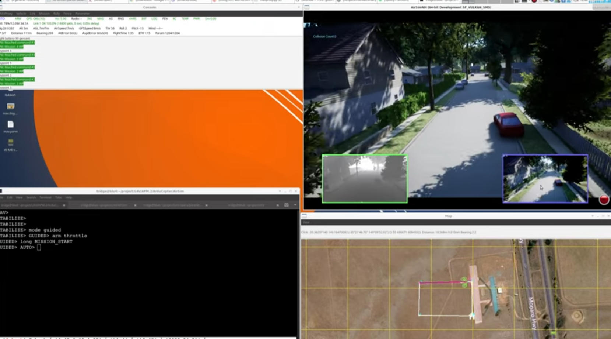

# [基于 Air 和 ArduPilot 的软件在环模拟](https://ardupilot.org/dev/docs/sitl-with-airsim.html)

目前，AirSim 和 ArduPilot 已经开发出对直升机和 Rover 的支持。

该集成方案已在单台 Linux 机器和多台运行 Ubuntu 16.04 和 18.04 的机器上进行了测试，也测试了在 Windows 10 系统下运行 AirSim 并在 WSL（Ubuntu 18.04）中运行 ArduPilot 的情况。AirSim 可以在 macOS 上运行，但尚未在 macOS 上测试与 ArduPilot 的集成。

AirSim 是一个优秀的平台，可用于在模拟车辆上测试和开发基于计算机视觉等技术的系统。它是一款功能非常丰富的模拟器，拥有精细的环境和用于数据采集的 API（Python、C++、ROS）。有关详细信息和可用功能，请参阅AirSim 的主自述文件。

使用 ArduPilot SITL 运行 AirSim 的演示

[](https://www.youtube.com/watch?v=ElFAqtpEfKo)


为了方便页面浏览，这里列出了几个主题：

* [__安装 AirSim__](#installing_airsim)
    *   [在 Windows 上构建](../build_windows.md)  
    *   [基于 Linux 构建](../build_linux.md)
    *   [基于 macOS 构建](../build_macos.md)  
* [__设置虚幻环境__](../unreal_custenv.md)
* [__使用 ArduPilot 的 AirSim__](#ardupilot_with_airsim)
* [__启动直升机的软件在环(SITL)模拟__](#copter)   
* [__启动 Rover 的软件在环模拟__](#rover)   
* [__使用激光雷达__](#lidar)   
* [__使用测距仪__](#rangefinder)
* [__使用遥控器进行手动飞行__](#manual_flying)   
* [__多载具仿真__](#multi_vehicle)   
* [__ROS与多载具__](#ROS)
* [__自定义环境__](#custom_environment)
* [__使用 AirSim API__](#api)
* [__在不同的机器上运行__](#different_machines)
* [__调试和开发工作流程__](#) 


## 使用 ArduPilot 的 AirSim <span id="ardupilot_with_airsim"></span>

请确保您已[安装 ArduPilot SITL](https://ardupilot.org/dev/docs/building-the-code.html#building-the-code)，完成 Unreal 环境的设置，或者已下载并验证相关二进制文件能够分别正常运行，然后再继续操作。如果您不熟悉 SITL，请参阅SITL 使用示例。

!!! 笔记
    在 UE 编辑器中运行：转到Edit->Editor Preferences，在 Search 框中键入CPU并确保 Use Less CPU when in Background 未选中。

!!! 笔记
    如果您使用 Windows Subsystem for Linux 2 在 Windows 下运行 ArduPilot 和 AirSim，请参阅 [链接](https://discuss.ardupilot.org/t/gsoc-2019-airsim-simulator-support-for-ardupilot-sitl-part-ii/46395/5) 了解如何连接它们。

[AirSim 的 settings.json 文件](https://github.com/microsoft/AirSim/blob/master/docs/settings.md) 用于指定飞行器及其各种属性。请参阅该页面了解可用选项。

它存储在以下位置——Windows：`Documents\AirSim`，Linux：`~/Documents/AirSim`

该文件采用标准的 JSON 格式。首次启动时，AirSim 会创建一个没有任何设置的 settings.json 文件。


## 启动直升机的软件在环(SITL)模拟 <span id="copter"></span>

使用 ArduCopter 的设置如下：

```json
{
  "SettingsVersion": 1.2,
  "LogMessagesVisible": true,
  "SimMode": "Multirotor",
  "OriginGeopoint": {
    "Latitude": -35.363261,
    "Longitude": 149.165230,
    "Altitude": 583
  },
  "Vehicles": {
    "Copter": {
      "VehicleType": "ArduCopter",
      "UseSerial": false,
      "LocalHostIp": "127.0.0.1",
      "UdpIp": "127.0.0.1",
      "UdpPort": 9003,
      "ControlPort": 9002
    }
  }
}
```

!!! 笔记
    之前在设置中 `SitlPort` 使用的是 `ControlPort` 。此更改适用于最新的 AirSim 主程序和二进制文件 v1.3.0 及更高版本。此更新向下兼容，因此即使您正在使用 `SitlPort`，它也能正常工作。

首先启动 AirSim，然后启动 ArduPilot SITL。

```shell
sim_vehicle.py -v ArduCopter -f airsim-copter --console --map
```

!!! 笔记
    最初，如果 ArduPilot SITL 尚未启动（这是由于锁定步长调度导致的），按下“播放”按钮后编辑器会卡住。运行 sim_vehicle.py 后应该就能恢复正常。


关闭时，请先按下停止按钮停止 AirSim 模拟，然后再关闭 ArduPilot。如果先关闭 ArduPilot，UE 会卡死，您需要强制关闭它。

您只需按下播放按钮，然后启动 ArduPilot 端即可重新启动，无需完全关闭编辑器然后再重新启动。


## 启动 Rover 的软件在环模拟 <span id="rover"></span>

settings.json使用 ArduRover 的方法：

```json
{
  "SettingsVersion": 1.2,
  "SimMode": "Car",
  "OriginGeopoint": {
    "Latitude": -35.363261,
    "Longitude": 149.165230,
    "Altitude": 583
  },
  "Vehicles": {
    "Rover": {
      "VehicleType": "ArduRover",
      "UseSerial": false,
      "LocalHostIp": "127.0.0.1",
      "UdpIp": "127.0.0.1",
      "UdpPort": 9003,
      "ControlPort": 9002,
      "AutoCreate": true,
      "Sensors": {
        "Imu": {
          "SensorType": 2,
          "Enabled": true
        },
        "Gps": {
          "SensorType": 3,
          "Enabled": true
        }
      }
    }
  }
}
```

首先启动 AirSim，然后启动 ArduPilot SITL。

```shell
sim_vehicle.py -v Rover -f airsim-rover --console --map
```

本页描述的其他功能等设置、命令和文件是直升机特有的，但也可用于漫游车。某些文件（例如脚本）和 settings.json 需要针对漫游车进行修改，为了保持页面简洁易用，我们没有添加漫游车的单独设置。


您可能需要对车辆进行调整才能正确使用，可以直接修改 [Tools/autotest/default_params](https://github.com/ArduPilot/ardupilot/tree/master/Tools/autotest/default_params) 中的 AirSim 车辆参数文件，或者您可以创建一个新的参数文件，并使用`--add-param-file`选项将其位置传递给 SITL `sim_vehicle.py`。


## 使用激光雷达 <span id="lidar"></span>

有关 AirSim 中激光雷达及其属性的信息，请参阅[激光雷达设置](../lidar.md)。

用于启动带有激光雷达的 ArduCopter 的当前settings.json文件

```json
{
  "SettingsVersion": 1.2,
  "SimMode": "Multirotor",
  "OriginGeopoint": {
    "Latitude": -35.363261,
    "Longitude": 149.165230,
    "Altitude": 583
  },
  "Vehicles": {
    "Copter": {
      "VehicleType": "ArduCopter",
      "UseSerial": false,
      "LocalHostIp": "127.0.0.1",
      "UdpIp": "127.0.0.1",
      "UdpPort": 9003,
      "ControlPort": 9002,
      "AutoCreate": true,
      "Sensors": {
        "Imu": {
          "SensorType": 2,
          "Enabled": true
        },
        "Gps": {
          "SensorType": 3,
          "Enabled": true
        },
        "Lidar1": {
          "SensorType": 6,
          "Enabled": true,
          "NumberOfChannels": 1,
          "PointsPerSecond": 5000,
          "DrawDebugPoints": false,
          "RotationsPerSecond": 10,
          "VerticalFOVUpper": 0,
          "VerticalFOVLower": 0,
          "HorizontalFOVStart": 0,
          "HorizontalFOVEnd": 359,
          "DataFrame": "SensorLocalFrame",
          "ExternalController": true
        }
      }
    }
  }
}
```

带激光雷达的直升机启动

```shell
sim_vehicle.py -v ArduCopter -f airsim-copter --add-param-file=libraries/SITL/examples/Airsim/lidar.parm --console --map
```

默认情况下，[BendyRuler 物体避障功能](https://ardupilot.org/copter/docs/common-oa-bendyruler.html#common-oa-bendyruler)与激光雷达一起使用，相关参数可在 Wiki 页面上查看，并应根据需要在`lidar.parm`文件中进行修改。

您可以通过在激光雷达传感器`DrawDebugPoints`设置中设置为`true`，在 AirSim 视口中启用激光雷达点的可视化。请注意，这可能会大幅降低帧率，甚至可能导致内存问题，并在v1.3.1早期版本中造成崩溃。

## 使用测距仪 <span id="rangefinder"></span> 

ArduPilot 中的测距仪在 AirSim 中称为距离传感器。详情请参阅[AirSim 的传感器页面](../sensors.md#distance-sensor)， ArduPilot 方面的信息请参阅测距仪设置。

下面列出了一些示例设置和参数，用于创建前向和下向测距仪。请注意，此处仅包含传感器设置，您可以轻松地将其替换 `Sensors` 上面激光雷达示例中的相应元素。

```json
"Sensors": {
    "Imu": {
      "SensorType": 2,
      "Enabled": true
    },
    "Gps": {
      "SensorType": 3,
      "Enabled": true
    },
    "Distance1": {
        "SensorType": 5,
        "Enabled": true,
        "DrawDebugPoints": true,
        "Yaw": 0, "Pitch": -90, "Roll": 0,
        "ExternalController": true
    },
    "Distance2": {
        "SensorType": 5,
        "Enabled": true,
        "DrawDebugPoints": true,
        "ExternalController": true
    }
  }
```

设置字段的详细信息请参见 [AirSim 传感器页面](../sensors.md#distance-sensor)。此处`DrawDebugPoints`已设置为`true`，因为它有助于解决方向问题。设置`ExternalController`为`false`可禁用向自动驾驶仪发送特定传感器数据，同时仍保持传感器存在。如果您想使用独立于现有避障系统的自定义避障系统，此功能非常有用。此设置适用于激光雷达和测距仪。

要启用测距仪，`RNGFNDx_TYPE` 应将其设置为 100 (SITL)。启用两个测距仪的参数 -
```json
# First Rangefinder (Distance Sensor in AirSim), facing down
RNGFND1_TYPE 100
RNGFND1_MIN_CM 0
RNGFND1_MAX_CM 4000
RNGFND1_ORIENT 25

# Second one, facing forward
RNGFND2_TYPE 100
RNGFND2_MIN_CM 0
RNGFND2_MAX_CM 4000
RNGFND2_ORIENT 0
```

测距仪可用于避障和精确测量高度。目前 ArduPilot 最多支持 10 个测距仪。


## 使用遥控器进行手动飞行 <span id="manual_flying"></span> 
如果要手动飞行，你需要一个遥控器 或 RC（Remote Control）。

只需将设备插入电脑即可使用。有关支持的设备详情和常见问题解答，请参阅AirSim 的远程控制页面。

!!! 笔记
    此功能目前尚未经过充分测试，因此您可能需要按照页面中所述修改操纵杆文件或设置一些遥控器参数，尤其是在使用不同控制器时。


## 多载具仿真 <span id="multi_vehicle"></span>
为了模拟 2 架直升机，我们添加了一个示例脚本，该脚本将创建 2 个直升机实例，并在其中一个实例中启用跟随模式。

该 `settings.json` 适用于 2 架直升机

```json
{
  "SettingsVersion": 1.2,
  "SimMode": "Multirotor",
  "OriginGeopoint": {
    "Latitude": -35.363261,
    "Longitude": 149.165230,
    "Altitude": 583
  },
  "Vehicles": {
    "Copter1": {
      "VehicleType": "ArduCopter",
      "UseSerial": false,
      "LocalHostIp": "127.0.0.1",
      "UdpIp": "127.0.0.1",
      "UdpPort": 9003,
      "ControlPort": 9002
    },
    "Copter2": {
      "VehicleType": "ArduCopter",
      "UseSerial": false,
      "LocalHostIp": "127.0.0.1",
      "UdpIp": "127.0.0.1",
      "UdpPort": 9013,
      "ControlPort": 9012,
      "X": 0, "Y": 3, "Z": 0
    }
  }
}
```

按下播放键，切换到 ardupilot 目录，然后运行脚本启动 2 个飞行器实例。您可以选择将地面控制站 (GCS) 所在计算机的 IP 地址作为第一个参数指定，默认值为 127.0.0.1，这意味着所有程序都位于同一台计算机上。

```shell
libraries/SITL/examples/Airsim/follow-copter.sh <IP>
```

连接 MAVProxy -

```shell
mavproxy.py --master=127.0.0.1:14550 --source-system 1 --console --map
```


这将打开地图，但地图上只会显示一辆载具。使用 `vehicle` 等命令可以在两辆载具 `vehicle 1` 和 `vehicle 2` 之间切换控制，之后两辆载具应该都会出现在地图上。

现在，您可以让第一架飞行器（即 SYSID 为 1 的飞行器）以引导或自动任务模式飞行，然后起飞第二架飞行器并将其置于跟随模式，之后第二架直升机将跟随第一架飞行器飞行。

要增加模拟载具的数量，只需修改脚本中的 `NCOPTERS` 变量，并在`settings.json`中添加每辆车的单独设置即可。

!!! 笔记
    在进行多载具仿真时，由于Linux、WSL、Cygwin等平台之间的网络差异，可能会出现一些问题。[本讨论帖](https://discuss.ardupilot.org/t/simulating-2-drones-with-sitl-airsim-in-windows-cygwin-wont-work/49292)或许能对解决此类问题有所帮助。

!!! 笔记
    端口之间 10 的差值至关重要，因为该脚本在启动载具时使用了实例（`instance`）选项，这会导致 ArduPilot 端的端口号增加 10。若需使用不同的端口，请按照页面末尾关于指定端口的说明，对脚本进行相应修改。


## ROS 与多载具仿真 <span id="ROS"></span>

使用 ROS 执行多车辆任务是一种常见的应用场景，而 Mavros 则用于与基于 Mavlink 的车辆协同工作。ArduPilot 中提供了一些示例脚本，演示了如何将 Mavros 与多车辆配合使用。

首先是 [multi_vehicle.sh](https://github.com/ArduPilot/ardupilot/tree/master/libraries/SITL/examples/Airsim/multi_vehicle.sh) 脚本，它会启动多个 ArduCopter 二进制文件，每个文件对应不同的 SYSID 和端口。用法与上面的脚本类似 -
```shell
libraries/SITL/examples/Airsim/multi_vehicle.sh <IP>
```
[multi_uav_ros_sitl.launch](https://github.com/ArduPilot/ardupilot/tree/master/libraries/SITL/examples/Airsim/multi_uav_ros_sitl.launch) 文件演示了如何编写一个使用 Mavros 控制多架无人机的启动文件。它为每架无人机创建一个不同的命名空间，并且每架无人机都有独立的 SYSID 和端口，具体取决于脚本中设置的变量。启动该文件 -
```shell
roslaunch libraries/SITL/examples/Airsim/multi_uav_ros_sitl.launch
```
可以通过连接到脚本为每架无人机打开的 TCP 端口，为每架无人机启动一个独立的 MAVProxy 实例。如果 Mavros 已经在运行，则不能使用 UDP 端口，因为 Mavros 会占用这些端口。

该`multi_vehicle.sh`脚本不会启用跟随模式，但如果还需要此功能，并且所有车辆都要显示在同一地面控制站 (GCS) 上，则`follow-copter.sh`可以添加多播和脚本中执行的跟随参数。


## 自定义环境 <span id="custom_environment"></span>

要在 Windows 上使用其他环境，请参阅 [AirSim 的自定义环境设置页面](../unreal_custenv.md) 。


### Linux
如上面链接的页面中所述，Linux 上没有 Epic Games 启动器，这意味着如果您需要使用自定义环境，则需要使用 Windows 机器。

在 Windows 机器上下载 Unreal 项目后，步骤相同，只需将项目复制到 Linux 机器上即可。

按照步骤操作，直到完成步骤 6 并编辑完`.uproject`文件。编辑完项目文件后，跳过步骤 7 和 8，直接进入 UnrealEngine 文件夹，运行命令启动 Unreal 编辑器`UnrealEngine/Engine/Binaries/Linux/UE4Editor`。

当虚幻引擎提示打开或创建项目时，选择“浏览”并选择您的自定义环境。之后，继续按照步骤 9 及后续步骤操作。

!!! 笔记
    在使用自定义环境时，场景中可能存在多个“玩家起点”（`Player Start`）对象。这种情况下，系统会随机选择其中一个作为起点，导致载具可能在半空中生成并坠落。

    你需要删除多余的`玩家起点`对象，仅保留一个，并将其位置移动到靠近地面的地方。请观看由 AirSim 开发人员制作的精彩视频[Unreal AirSim 设置](https://youtu.be/1oY8Qu5maQQ) ，特别是 5:00 处，该片段演示了如何删除这些对象以及如何调整其位置。


## 使用 AirSim API <span id="api"></span>
[AirSim 的 API 文档](../apis.md)详细介绍了可用的各类 API 及其使用方法。

目前，ArduPilot 载具不支持通过 AirSim API 控制运动；不过，任何直接连接到 ArduPilot（而非通过 AirSim API）的运动控制方法均可正常工作，例如使用 DroneKit 或结合 Mavros 使用 ROS。

[图像 API](../image_apis.md) 已在 Copter（多旋翼飞行器）上通过测试；如需现成的示例代码，请查看 [PythonClient/multirotor](https://github.com/OpenHUTB/air/tree/main/PythonClient/multirotor) 目录下的文件（例如 [opencv_show.py](https://github.com/OpenHUTB/air/blob/main/PythonClient/multirotor/opencv_show.py)）。此外，用于获取环境信息、与环境交互或采集传感器数据的各类 API 也均可正常使用。

系统还增加了 ROS 封装（wrapper）。请参阅 [airsim_ros_pkgs](../airsim_ros_pkgs.md) 获取 ROS API 相关内容，参阅 [airsim_tutorial_pkgs](../airsim_tutorial_pkgs.md) 获取教程。请注意，此处同样存在关于控制载具运动的局限性。

!!! 注意

    并非所有 API 都已在 Copter 上进行过测试；如果您发现某些功能无法正常工作，或者希望增加对特定功能的支持，请告知我们。


## 在不同机器上运行 <span id="different_machines"></span>

修改 `settings.json` 文件中的以下内容：

* 将 `UdpIp` 设置为运行 ArduPilot 的机器的 IP 地址（在 Windows 上可使用 `ipconfig` 查看，在 Linux 上可使用 `ifconfig` 查看）。

* 将 `LocalHostIp` 设置为当前运行 AirSim 的机器的 IP 地址（需指定具体的网络适配器，如以太网或 WiFi）；也可设置为 `0.0.0.0` 以接收来自所有网络的信号。

在 `sim_vehicle.py` 中使用 `-A` 参数（该参数会将后续参数传递给 SITL 实例），并配合 `--sim-address` 指定 AirSim 的 IP 地址。

示例如下：
```shell
sim_vehicle.py -v ArduCopter -f airsim-copter --console --map -A --sim-address=127.0.0.1
```

!!! 笔记
    如果使用 Windows，您可能需要禁用 Windows 防火墙才能接收消息。


### 使用不同端口

`UdpPort` 指定了 ArduPilot 接收传感器数据的端口号（即 AirSim 发送数据至的端口）。

`ControlPort` 指定了 AirSim 接收旋翼控制指令的电机控制端口。

* `--sim-port-in` 应与传感器端口（即 `UdpPort` 中指定的端口）一致。

* `--sim-port-out` 应与电机控制端口（即 `ControlPort` 中指定的端口）一致。

与前述更改 IP 地址的方法类似，使用 `-A` 参数向 SITL 实例传递这些参数。示例如下：

```shell
sim_vehicle.py -v ArduCopter -f airsim-copter --console --map -A "--sim-port-in=9003 --sim-port-out=9002"
```

## 开发工作流程
AirSim 的 [开发工作流程页面](../dev_workflow.md) 介绍了在 Windows 上开发 AirSim 的推荐配置。

对于 Linux，请在 AirLib 或 Unreal/Plugins 文件夹中修改代码，然后运行 ​​`./build.sh` 进行重新构建。此步骤还会将构建输出复制到 Blocks 示例项目中。随后，您可以按照步骤启动 Unreal Editor 并打开该项目。如果系统提示缺少 .so 文件，请选择“Yes”（是）以重新构建。

[Linux 故障排查](../build_linux.md#faqs)

[Windows 常见问题解答](../build_windows.md#faq)

[通用常见问题解答](../faq.md)

在报告任何问题之前，请将 ArduPilot 和 AirSim 更新至最新的 `master` 分支版本。更新本地 AirSim 仓库后，请务必运行[Unreal 环境设置](../unreal_blocks.md) 页面中提到的命令，否则更新内容将无法在仿真中生效。
