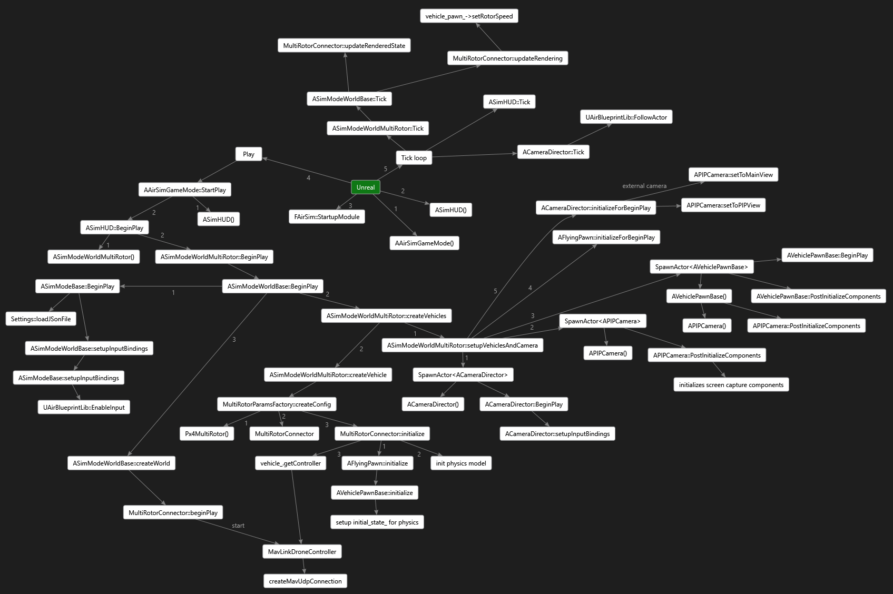

# 代码结构

## AirLib

大部分代码位于 AirLib 库中。这是一个独立的库，您可以使用任何 C++11 编译器对其进行编译。

AirLib由以下组件构成：

1. [*物理引擎：*](https://github.com/microsoft/AirSim/tree/main/AirLib/include/physics) 这是一个仅包含头文件的物理引擎。它的设计目标是速度快且易于扩展，以便实现不同的载具模型。
2. [*传感器模型：*](https://github.com/microsoft/AirSim/tree/main/AirLib/include/sensors) 这是气压计、IMU、GPS 和磁力计的仅头文件模型。
3. [*载具模型：*](https://github.com/microsoft/AirSim/tree/main/AirLib/include/vehiclesr) 这是仅包含车辆配置和模型的头文件模型。目前，我们已实现了多旋翼飞行器的模型以及 X 配置中的 PX4 四旋翼飞行器的配置。[MultiRotorParams.hpp](https://github.com/OpenHUTB/air/blob/main/AirLib/include/vehicles/multirotor/MultiRotorParams.hpp) 中定义了几种不同的多旋翼飞行器模型，其中也包括六旋翼飞行器。
4. [*API 相关的文件：*](https://github.com/microsoft/AirSim/tree/main/AirLib/include/api) AirLib 的这一部分为我们的 API 提供抽象基类，并为特定载具平台（例如 MavLink）提供具体实现。它还包含 RPC 客户端和服务器的类。

除此之外，所有常用工具都定义在 [`common/`](https://github.com/OpenHUTB/air/tree/main/AirLib/include/common) 子文件夹中。其中一个重要的文件是 [AirSimSettings.hpp](https://github.com/OpenHUTB/air/blob/main/AirLib/include/common/AirSimSettings.hpp)，如果需要在 `settings.json` 中添加任何新字段，则需要修改此文件。

Air 支持多旋翼飞行器的不同固件，例如其自身的 SimpleFlight、PX4 和 ArduPilot，与每个固件通信的文件都放置在 [`multirotor/firmwares`](https://github.com/OpenHUTB/air/tree/main/AirLib/include/vehicles/multirotor/firmwares) 中的相应子文件夹中。

特定载具的 API 定义在 `api/` 子文件夹中，同时定义的还有所需的结构体。[`AirLib/src/`](https://github.com/OpenHUTB/air/tree/main/AirLib/src) 目录包含 .cpp 文件，其中实现了 .hpp 文件中定义的各种方法。例如，[MultirotorApiBase.cpp](https://github.com/OpenHUTB/air/blob/main/AirLib/src/vehicles/multirotor/api/MultirotorApiBase.cpp) 包含多旋翼飞行器 API 的基本实现，如有需要，也可以在特定的固件文件中对其进行重写。

## Unreal/Plugins/AirSim

这是项目中唯一依赖于虚幻引擎的部分。我们将其隔离，以便也能像在 [Unity](https://microsoft.github.io/AirSim/Unity.html) 平台上那样，为其他平台实现模拟器。虚幻引擎代码利用了其基于 UObject 的类，包括蓝图。`Source/` 文件夹包含 C++ 文件，而 `Content/` 文件夹包含蓝图和资源文件。一些主要组件如下所述：

1. *SimMode_ 类*: SimMode 类有助于实现多种不同的模式，例如纯计算机视觉模式，该模式下没有车辆，也没有针对特定车辆（目前包括汽车和多旋翼飞行器）的仿真。载具类位于 [`Vehicles/`](https://github.com/OpenHUTB/air/tree/main/Unreal/Plugins/AirSim/Source/Vehicles) 目录中。 
2. *PawnSimApi*: 这是所有载具棋子(Pawn)可视化的[基类](https://github.com/OpenHUTB/air/blob/main/Unreal/Plugins/AirSim/Source/PawnSimApi.cpp)。每种载具都有自己的子棋子类（多旋翼飞行器 | 汽车 | 计算机视觉）。 
3. [UnrealSensors](https://github.com/OpenHUTB/air/tree/main/Unreal/Plugins/AirSim/Source/UnrealSensors): 包含距离传感器和激光雷达传感器的实现。
4. *WorldSimApi*: 实现了大部分与环境和载具无关的 API

除此之外，[`PIPCamera`](https://github.com/OpenHUTB/air/blob/main/Unreal/Plugins/AirSim/Source/PIPCamera.cpp) 包含相机初始化代码，[`UnrealImageCapture`](https://github.com/OpenHUTB/air/blob/main/Unreal/Plugins/AirSim/Source/UnrealImageCapture.cpp) 和 [`RenderRequest`](https://github.com/OpenHUTB/air/blob/main/Unreal/Plugins/AirSim/Source/RenderRequest.cpp) 包含图像渲染代码。[`AirBlueprintLib`](https://github.com/microsoft/AirSim/blob/main/Unreal/Plugins/AirSim/Source/AirBlueprintLib.cpp) 包含许多用于与[引擎](https://github.com/OpenHUTB/engine)交互的实用工具和封装方法。

## MavLinkCom

这是 [Chris Lovett](https://github.com/lovettchris) 开发的库，它提供了用于与 MavLink 设备通信的 C++ 类。该库是独立的，可用于任何项目。更多信息请访问 [MavLinkCom](mavlinkcom.md) 。

## 示例程序

我们创建了一些示例程序来演示如何使用 API。请参阅 HelloDrone 和 DroneShell。DroneShell 演示了如何使用 UDP 连接到模拟器。该模拟器运行着一个服务器（类似于 DroneServer）。

## PythonClient

[PythonClient](https://github.com/OpenHUTB/air/tree/main/PythonClient) 包含 Python API 封装文件和演示其用法的示例程序。

## 贡献

查看 [贡献指南](CONTRIBUTING.md)

## 引擎框架

下图展示了[模拟器引擎](https://github.com/OpenHUTB/engine)如何加载和调用 [Air](https://github.com/OpenHUTB/air) ：

