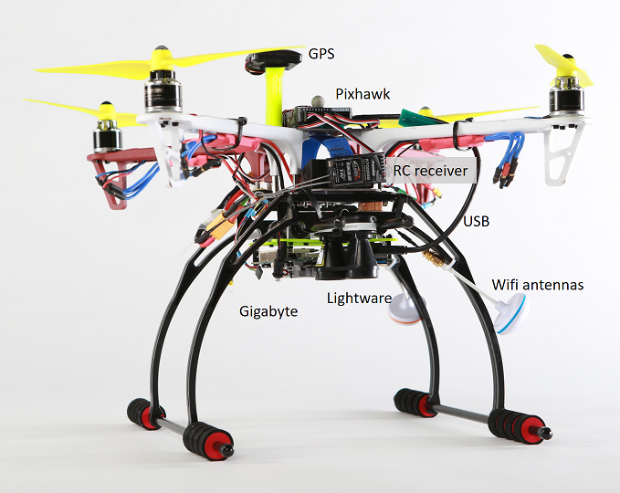

# 在真正的无人机上使用 AirLib

AirLib 库可以编译并部署到真实无人机的配套计算机上。在我们的测试中，我们将一台技嘉 Brix BXi7-5500 超紧凑型 PC 安装在无人机上，并通过 USB 连接到 Pixhawk 飞行控制器。这台技嘉 PC 运行的是 Ubuntu 系统，因此我们可以通过 Wi-Fi SSH 连接到它：



连接成功后，您可以使用以下命令行运行 MavLinkTest：
```
MavLinkTest -serial:/dev/ttyACM0,115200 -logdir:. 
```
这样就会生成一个飞行日志文件，然后就可以 [在模拟器中回放](playback.md) 该文件。

您还可以添加 `-proxy:192.168.1.100:14550` 将 MavLinkTest 连接到远程计算机，您可以在该计算机上运行 [QGroundControl](https://github.com/mavlink/qgroundcontrol) 或我们的 [PX4 日志查看器](log_viewer.md) ，这是查看无人机运行情况的另一种便捷方法。

MavLinkTest 提供了一些简单的命令来测试您的无人机，以下是一些简单的命令示例：

```
arm
takeoff 5
orbit 10 2
```

这将启动无人机，从5米高处起飞，然后以2米/秒的速度进行半径10米的盘旋飞行。输入“？”查找所有可用指令。

!!! 注意
    在 MavLinkTest 和 DroneShell 中，某些命令（例如 `orbit`）的名称不同，语法也不同（例如 `circlebypath -radius 10 -velocity 21`）。


无人机着陆后，您可以停止 MavLinkTest 并复制生成的 *.mavlink 日志文件。

# DroneServer 和 DroneShell

确认 MavLinkTest 运行正常后，您还可以按如下方式运行 DroneServer 和 DroneShell。首先，使用本地代理运行 MavLinkTest，将所有数据发送到 DroneServer：

```
MavLinkTest -serial:/dev/ttyACM0,115200 -logdir:. -proxy:127.0.0.1:14560
```
将 ~/Documents/AirSim/settings.json 中改为 "serial":false，因为我们希望 DroneServer 查找此 UDP 连接。

```
DroneServer 0
```

最后，您现在可以将 DroneShell 连接到此 DroneServer 实例，并使用 DroneShell 命令来操控您的无人机：

```
DroneShell
==||=>
        Welcome to DroneShell 1.0.
        Type ? for help.
        Microsoft Research (c) 2016.

Waiting for drone to report a valid GPS location...
==||=> requestcontrol
==||=> arm
==||=> takeoff
==||=> circlebypath -radius 10 -velocity 2
```

## PX4 专用工具

您可以运行 MavlinkCom 库和 MavLinkTest 应用程序来测试您的配套计算机和飞行控制器之间的连接。

## 这是如何运作的？

AirSim 使用了由 @lovettchris 开发的 MavLinkCom 组件。MavLinkCom 采用代理架构，您可以使用串口或 UDP 协议与 PX4 建立连接，其他组件可以共享此连接。当 PX4 发送 MavLink 消息时，所有组件都会收到该消息。如果某个组件发送消息，则只有 PX4 会收到该消息。这使得您可以将任意数量的组件连接到 PX4。[该代码](https://github.com/microsoft/AirSim/blob/main/AirLib/include/vehicles/multirotor/firmwares/mavlink/MavLinkMultirotorApi.hpp#L600) 为 LogViewer 和 QGC 打开连接。您可以根据需要添加更多功能。

如果要同时使用 QGC 和 AirSim，则需要将串口分配给 QGC 使用。QGC 会打开一个 TCP 连接作为代理，这样任何其他组件都可以连接到 QGC 并向 QGC 发送 MavLinkMessage 消息，然后 QGC 会将该消息转发给 PX4。因此，您需要指示 AirSim 连接到 QGC 并将串口分配给 QGC 使用。

对于配套控制板，我们之前的做法是在无人机上安装一块技嘉Brix主板。这是一台功能齐全的x86计算机，可以通过USB接口连接到PX4。Brix主板上安装了Ubuntu系统，并运行了 [DroneServer](https://github.com/Microsoft/AirSim/tree/main/DroneServer) 软件。DroneServer创建了一个API接口，我们可以通过C++客户端代码（或Python代码）与之通信，并将API调用转换为MavLink消息。这样，就可以针对同一个API编写代码，在模拟器中进行测试，然后在实际飞行器上运行相同的代码。因此，配套计算机上运行着DroneServer以及客户端代码。

