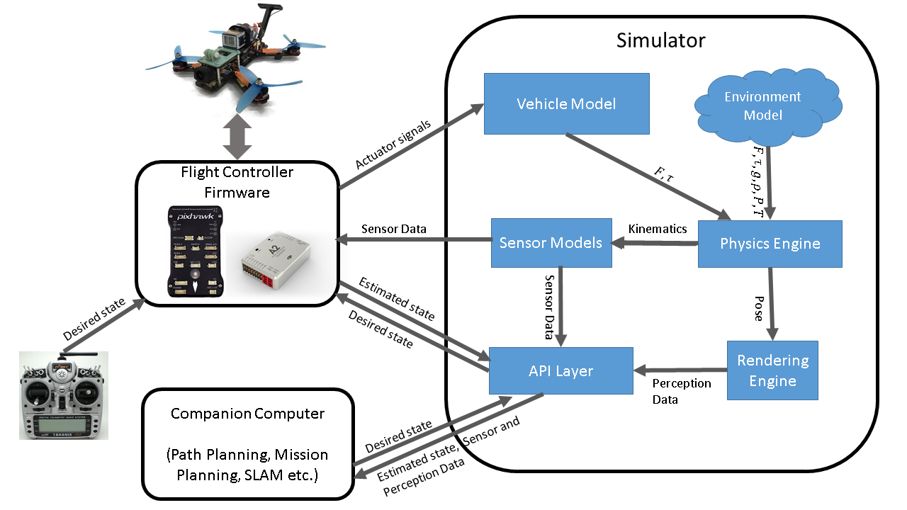

# 论文
您可以阅读 [正在撰写的论文（暂未完成）](https://www.microsoft.com/en-us/research/wp-content/uploads/2017/02/aerial-informatics-robotics.pdf) 了解更多关于架构和设计方面的信息。您可以这样引用：

```
@techreport{MSR-TR-2017-9,
     title = { {A}erial {I}nformatics and {R}obotics Platform },
     author = {Shital Shah and Debadeepta Dey and Chris Lovett and Ashish Kapoor},
     year = {2017},
     institution = {Microsoft Research},
     number = { {M}{S}{R}-{T}{R}-2017-9} }
}
```

# 架构

下面概述了不同组件之间如何相互作用。


