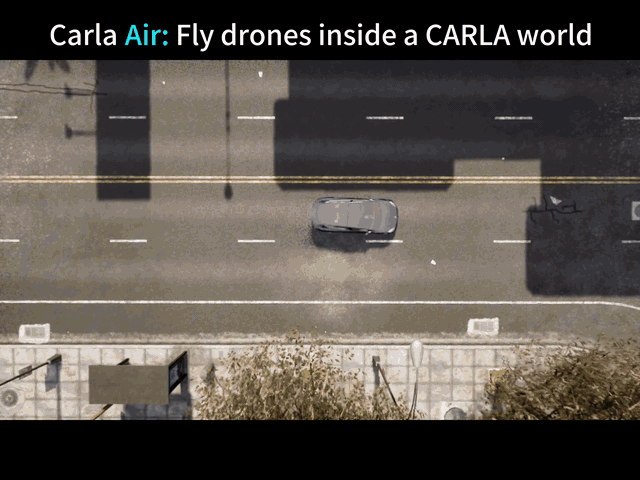
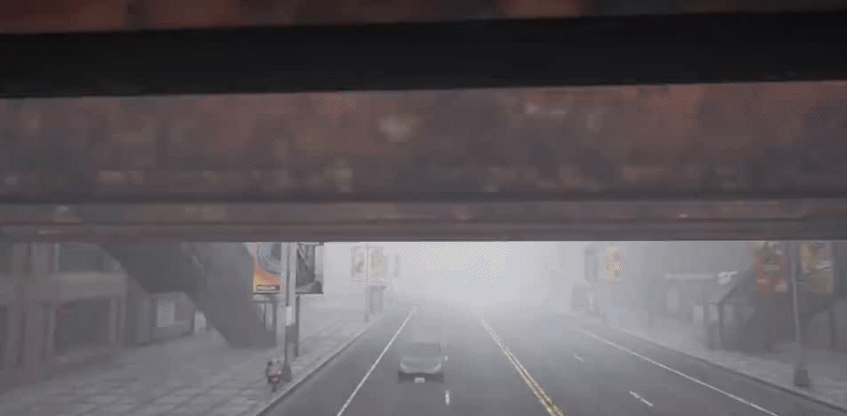
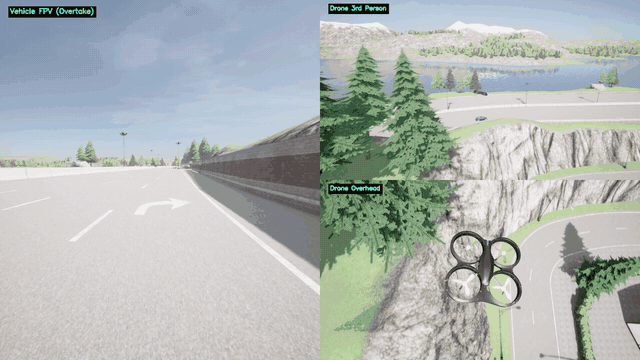
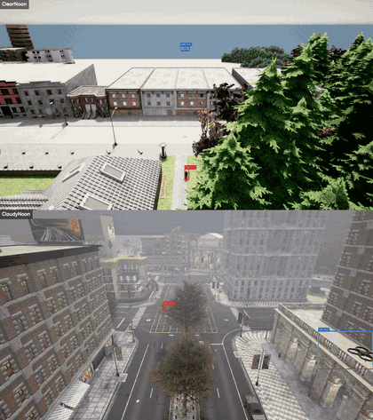
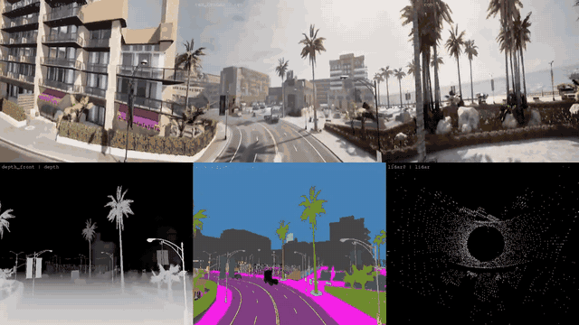
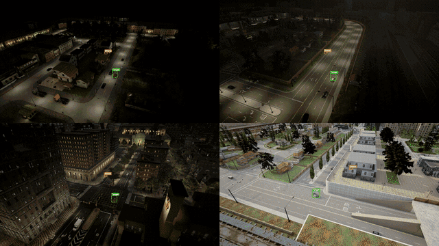
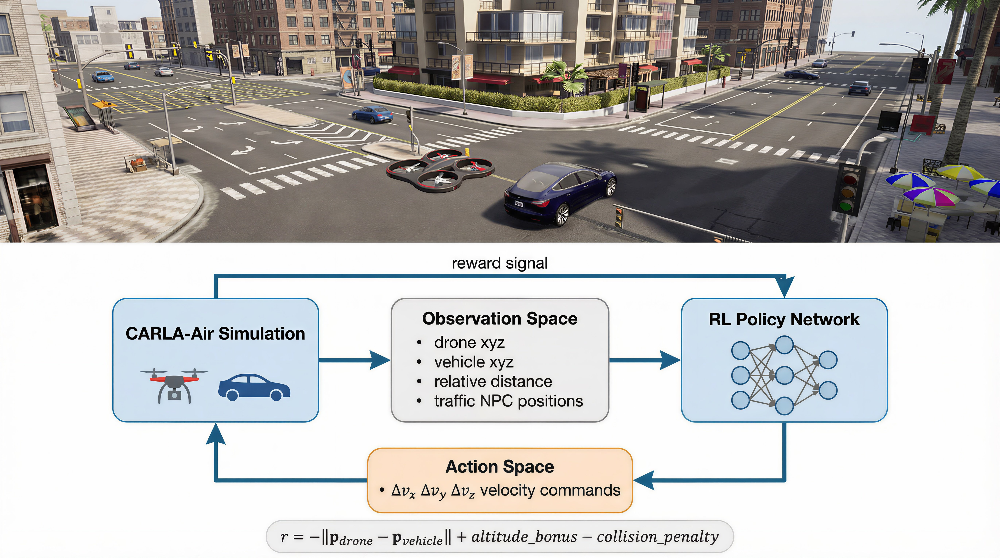
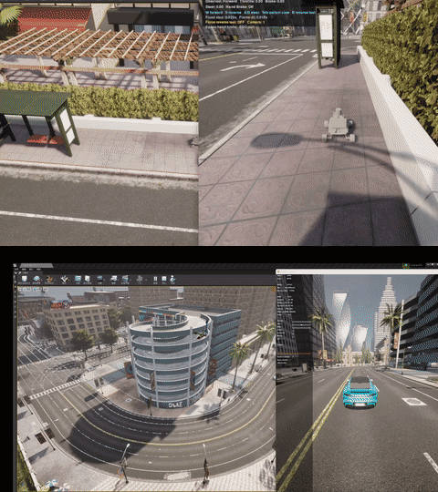
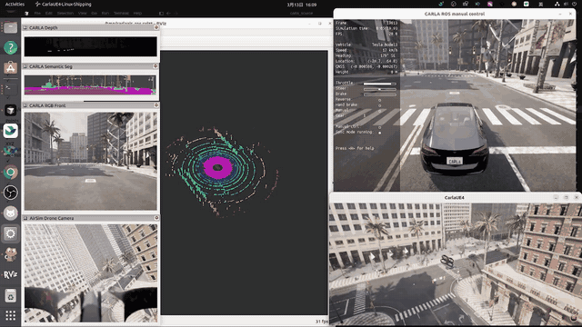

## 空地一体仿真

<!-- 更新至：
Update README_CN.md
https://github.com/louiszengCN/CarlaAir/commit/00d93b172ded2b9358347d20e9a02693a4556fee
-->

该模块是一个开源的空地联合仿真平台。它通过在底层 C++ 将全球领先的自动驾驶仿真器（Carla）与机器人仿真器（AirSim）合并为单一的 `ASimWorldGameMode`，实现了真正的帧级传感器同步、统一的物理引擎，以及无缝的双 Python API 交互。






## 📌 目录

- [✨ 核心亮点](#highlights)
- [🏆 平台对比](#platform_comparison) — 15 款仿真器横向对比
- [🎮 快速开始](#quick_start) — 4 步上手
- [🐍 一个脚本，两个世界](#one_script) — 双 API 代码示例
- [🔬 研究方向与工作流](#research_directions) — W1–W5 验证工作流
- [⌨️ 飞行控制说明](#flight_controls)
- [📚 文档与教程](#documentation) — 8 个渐进式教程
- [📜 许可证与致谢](#license)

## ✨ 核心亮点 <span id="highlights"></span>

| | |
|---|---|
| 🏗️ **单进程组合式集成** | `CARLAAirGameMode` 继承 Carla 并组合 AirSim。仅修改上游 2 个文件（约 35 行）。无桥接，无延迟。 |
| 🎯 **绝对坐标对齐** | Carla（左手系）与 AirSim（北东地，NED）坐标系之间精确 `0.0000 m` 误差。 |
| 📸 **多达 18 种传感器模态** | RGB、深度图、语义分割、实例分割、LiDAR、雷达、表面法线、IMU、GNSS、气压计 -- 空地传感器逐帧对齐。 |
| 🔄 **零修改代码迁移** | 现有 Carla 和 AirSim Python 脚本及 ROS 2 节点可直接在 Carla-Air 上运行，无需任何代码改动。89/89 Carla API 测试全部通过。 |
| ⚡ **联合负载约 20 FPS** | 中等联合配置（车辆 + 无人机 + 8 个传感器）稳定运行在 19.8 +/- 1.1 FPS。通信开销 < 0.5 ms（对比桥接联合仿真的 1--5 ms）。 |
| 🛡️ **3 小时稳定性验证** | 357 次生成/销毁循环，零崩溃，零内存累积（R² = 0.11）。 |
| 🚁 **内置 FPS 无人机控制** | 在视口中使用 WASD + 鼠标直接驾驶无人机 -- 无需编写 Python 脚本。 |
| 🚦 **逼真城市交通** | 规则驱动的交通流、具有社会行为的行人、13 张城市地图。 |
| 🧩 **可扩展资产导入管线** | 支持导入自定义机器人平台、无人机配置、车辆模型和环境地图。 |


---

## 🏆 平台对比 <span id="platform_comparison"></span>

CARLA-Air 与 14 个现有仿真平台的全面对比（基于[技术报告](https://arxiv.org/abs/2603.28032)表 1）。

<table>
  <thead>
    <tr>
      <th>类别</th>
      <th>平台</th>
      <th>城市交通</th>
      <th>行人</th>
      <th>无人机飞行</th>
      <th>单进程</th>
      <th>共享渲染器</th>
      <th>原生 API</th>
      <th>联合传感器</th>
      <th>预编译包</th>
      <th>测试套件</th>
      <th>自定义资产</th>
      <th>开源</th>
    </tr>
  </thead>
  <tbody>
    <tr>
      <td rowspan="5"><i>自动驾驶</i></td>
      <td>CARLA</td>
      <td>✓</td><td>✓</td><td>✗</td><td>✓</td><td>✓</td><td>✓</td><td>✗</td><td>✓</td><td>✗</td><td>✓</td><td>✓</td>
    </tr>
    <tr>
      <td>LGSVL</td>
      <td>✓</td><td>✓</td><td>✗</td><td>✓</td><td>✓</td><td>✓</td><td>✗</td><td>✓</td><td>✗</td><td>~</td><td>✓</td>
    </tr>
    <tr>
      <td>SUMO</td>
      <td>✓</td><td>✓</td><td>✗</td><td>✓</td><td>✗</td><td>✓</td><td>✗</td><td>✓</td><td>✗</td><td>✗</td><td>✓</td>
    </tr>
    <tr>
      <td>MetaDrive</td>
      <td>✓</td><td>~</td><td>✗</td><td>✓</td><td>~</td><td>✓</td><td>✗</td><td>✗</td><td>✗</td><td>✗</td><td>✓</td>
    </tr>
    <tr>
      <td>VISTA</td>
      <td>~</td><td>✗</td><td>✗</td><td>✓</td><td>~</td><td>✓</td><td>✗</td><td>✗</td><td>✗</td><td>✗</td><td>✓</td>
    </tr>
    <tr>
      <td rowspan="6"><i>空中 / 无人机</i></td>
      <td>AirSim</td>
      <td>✗</td><td>✗</td><td>✓</td><td>✓</td><td>✓</td><td>✓</td><td>✗</td><td>✓</td><td>✗</td><td>✓</td><td>✓</td>
    </tr>
    <tr>
      <td>Flightmare</td>
      <td>✗</td><td>✗</td><td>✓</td><td>✓</td><td>✓</td><td>✓</td><td>✗</td><td>✗</td><td>✗</td><td>~</td><td>✓</td>
    </tr>
    <tr>
      <td>FlightGoggles</td>
      <td>✗</td><td>✗</td><td>✓</td><td>✓</td><td>✓</td><td>✓</td><td>✗</td><td>✗</td><td>✗</td><td>~</td><td>✓</td>
    </tr>
    <tr>
      <td>Gazebo/RotorS</td>
      <td>~</td><td>~</td><td>✓</td><td>✓</td><td>~</td><td>✓</td><td>✗</td><td>✓</td><td>✗</td><td>✓</td><td>✓</td>
    </tr>
    <tr>
      <td>OmniDrones</td>
      <td>✗</td><td>✗</td><td>✓</td><td>✓</td><td>✓</td><td>✓</td><td>✗</td><td>✗</td><td>✗</td><td>✓</td><td>✓</td>
    </tr>
    <tr>
      <td>gym-pybullet-drones</td>
      <td>✗</td><td>✗</td><td>✓</td><td>✓</td><td>~</td><td>✓</td><td>✗</td><td>✗</td><td>✗</td><td>~</td><td>✓</td>
    </tr>
    <tr>
      <td rowspan="3"><i>联合 / 协同仿真</i></td>
      <td>TranSimHub</td>
      <td>✓</td><td>✓</td><td>✓</td><td>✗</td><td>✗</td><td>✗</td><td>~</td><td>—</td><td>✗</td><td>✗</td><td>✓</td>
    </tr>
    <tr>
      <td>CARLA+SUMO</td>
      <td>✓</td><td>✓</td><td>✗</td><td>✗</td><td>✗</td><td>~</td><td>✗</td><td>—</td><td>✗</td><td>✗</td><td>✓</td>
    </tr>
    <tr>
      <td>AirSim+Gazebo</td>
      <td>~</td><td>~</td><td>✓</td><td>✗</td><td>✗</td><td>~</td><td>~</td><td>—</td><td>✗</td><td>~</td><td>✓</td>
    </tr>
    <tr>
      <td rowspan="5"><i>具身 AI 与 RL</i></td>
      <td>Isaac Lab</td>
      <td>✗</td><td>✗</td><td>~</td><td>✓</td><td>✓</td><td>✓</td><td>✗</td><td>✗</td><td>✓</td><td>✓</td><td>✓</td>
    </tr>
    <tr>
      <td>Isaac Gym</td>
      <td>✗</td><td>✗</td><td>~</td><td>✓</td><td>✓</td><td>✓</td><td>✗</td><td>✗</td><td>✗</td><td>✗</td><td>✓</td>
    </tr>
    <tr>
      <td>Habitat</td>
      <td>✗</td><td>~</td><td>✗</td><td>✓</td><td>✓</td><td>✓</td><td>✗</td><td>✗</td><td>✗</td><td>✗</td><td>✓</td>
    </tr>
    <tr>
      <td>SAPIEN</td>
      <td>✗</td><td>✗</td><td>✗</td><td>✓</td><td>✓</td><td>✓</td><td>✗</td><td>✗</td><td>✗</td><td>~</td><td>✓</td>
    </tr>
    <tr>
      <td>RoboSuite</td>
      <td>✗</td><td>✗</td><td>✗</td><td>✓</td><td>✓</td><td>✓</td><td>✗</td><td>✗</td><td>✗</td><td>~</td><td>✓</td>
    </tr>
    <tr style="background-color: #f0f7ff;">
      <td><b>本项目</b></td>
      <td><b>CARLA-Air</b></td>
      <td><b>✓</b></td><td><b>✓†</b></td><td><b>✓</b></td><td><b>✓</b></td><td><b>✓</b></td><td><b>✓</b></td><td><b>✓</b></td><td><b>✓</b></td><td><b>✓</b></td><td><b>✓</b></td><td><b>✓</b></td>
    </tr>
  </tbody>
</table>

<p><sup>✓ = 支持；~ = 部分或受限支持；✗ = 不支持；— = 不适用。<br/>
† 行人 AI 继承自 CARLA，功能完整；联合场景下高密度 Actor 的行为是当前工程优化目标。</sup></p>

---

## 🎮 快速开始 <span id="quick_start"></span>

### 选项 A：使用预编译版本（推荐）

```sh
tar xzf CarlaAir-v0.1.7.tar.gz
cd CarlaAir-v0.1.7

# 2. 一键环境配置（仅首次需要）
bash env_setup/setup_env.sh      # 创建 conda 环境，安装依赖，部署 carla 模块
conda activate carlaAir
bash env_setup/test_env.sh        # 验证环境：应全部显示 PASS

# 3. 启动仿真器（自动生成交通流）
./CarlaAir.sh Town10HD

# 4. 运行展示脚本！（另开一个终端）
conda activate carlaAir
python3 examples/quick_start_showcase.py
```

> **你将看到：** 一辆特斯拉在城市中自动巡航，无人机从空中追踪。4 分屏同时展示 **RGB · 深度图 · 语义分割 · LiDAR 鸟瞰** — 全部实时同步。天气自动轮换。按 **WASD** 随时接管驾驶！

### 选项 B：从源码编译

如果您需要修改底层 C++ 代码，请参考 [源码编译指南](build_guide_ubuntu.md)，了解如何使用 UE4.26 编译 CarlaAir。

---

## 🐍 一个脚本，两个世界 <span id="one_script"></span>

两套 API 共享**同一个仿真世界** — 无桥接、无同步烦恼。

```python
import carla, airsim

carla_client = carla.Client("localhost", 2000)
air_client   = airsim.MultirotorClient(port=41451)
world = carla_client.get_world()

world.set_weather(carla.WeatherParameters.HardRainSunset)  # 一次天气调用，影响所有传感器 — 地面和空中

vehicle = world.spawn_actor(vehicle_bp, spawn_point) # 生成一辆汽车，自动驾驶
vehicle.set_autopilot(True)

air_client.takeoffAsync().join() # 无人机起飞 — 同一个世界，同一场雨，同一套物理
air_client.moveToPositionAsync(80, 30, -25, 5)
```

**6 个演示脚本** — 逐个试试：

```sh
python3 examples/quick_start_showcase.py   # 🎬 4分屏传感器 + 无人机追踪 + 天气轮换
python3 examples/drive_vehicle.py          # 🚗 WASD 驾驶特斯拉
python3 examples/walk_pedestrian.py        # 🚶 鼠标+键盘 城市漫步
python3 examples/switch_maps.py            # 🗺️  自动飞越全部 13 张地图
python3 examples/sensor_gallery.py         # 📸 单车 6 传感器网格展示
python3 examples/air_ground_sync.py        # 🔄 车+无人机分屏：同一场雨，同一世界
```

**录制工具** — 录制车辆、无人机、行人轨迹，然后用导演相机回放：

```sh
python3 examples/recording/record_vehicle.py     # 🚗 键盘驾驶并录制车辆轨迹
python3 examples/recording/record_drone.py       # 🚁 飞行并录制无人机轨迹（零侵入）
python3 examples/recording/record_walker.py      # 🚶 行走并录制行人轨迹
python3 examples/recording/demo_director.py \    # 🎬 多轨迹回放 + 自由相机 + MP4 录制
    trajectories/vehicle_*.json trajectories/drone_*.json
```


---

## 🔬 研究方向与工作流 <span id="research_directions"></span>

CARLA-Air 旨在支持空地一体具身智能的四大研究方向：

1. **空地协同** -- 异构空地智能体在共享城市环境中协作。
2. **具身导航（VLN/VLA）** -- 视觉语言驱动的导航与动作执行，基于高保真城市场景。
3. **多模态感知与数据集** -- 多样条件下的空地同步传感器数据采集。
4. **强化学习策略训练** -- 空地联合交互的闭环强化学习训练。

平台提供五个覆盖上述方向的参考工作流：

| | 工作流 | 研究方向 | 关键成果 |
|---|---|---|---|
| W1 | 空地协同 | 空地协同 | 实时跨域协调控制 |
| W2 | VLN/VLA 任务 | 具身导航 | 跨视角 VLN 数据管线 |
| W3 | 多模态数据集采集 | 感知与数据集 | 12 路同步，1-tick 对齐 |
| W4 | 跨视角感知 | 感知与数据集 | 14/14 天气预设验证通过 |
| W5 | RL 训练环境 | 强化学习策略训练 | 357 次重置循环，0 次崩溃 |

<b>W1：空地协同</b>




<b>W2：VLN/VLA (Vision Language-driven Navigation/Action) 数据生成</b>




<b>W3：多模态数据集采集</b>



<b>W4：跨视角感知</b>




<b>W5：RL 训练环境</b>




<b>自定义资产导入</b>




<b>ROS 2 支持</b>：63 个 Topic 覆盖双仿真后端




---

## ⌨️ 飞行控制说明 <span id="flight_controls"></span>

仿真器运行时，点击窗口内部捕获鼠标：

| 按键 | 功能 |
|-----|--------|
| `W` / `A` / `S` / `D` | 前进 / 左移 / 后退 / 右移 |
| `Space` / `Shift` | 上升 / 下降 |
| `Mouse` | 偏航转向 |
| `Scroll` | 调节速度 |
| `N` | 切换天气 |
| `P` | 碰撞模式切换 |
| `H` | 帮助菜单 |
| `Tab` | 释放 / 捕获鼠标 |
| `1` / `2` / `3` | 传感器画面 |

---

## 📚 文档与教程 <span id="documentation"></span>

我们提供了 **6 个精选 Python 示例**，展示核心空地协同能力：

| 示例 | 说明 |
|---------|-------------|
| `quick_start_showcase.py` | 4 分屏传感器 + 无人机追踪 + 天气轮换 |
| `drive_vehicle.py` | WASD 键盘驾驶特斯拉 |
| `walk_pedestrian.py` | 鼠标视角城市漫步 |
| `switch_maps.py` | 自动飞越全部 13 张地图 |
| `sensor_gallery.py` | 单车 6 传感器网格展示 |
| `air_ground_sync.py` | 车 + 无人机分屏：同一场雨，同一世界 |

**分步教程**（8 个脚本位于 `CarlaAir_Release/guide/examples/`，适合初学者）：

| # | 教程 | 学习内容 |
|---|----------|---------------------|
| 01 | `01_hello_world.py` | 连接双 API，验证环境配置 |
| 02 | `02_weather_control.py` | 实时更改天气参数 |
| 03 | `03_spawn_traffic.py` | 生成车辆与行人 |
| 04 | `04_sensor_capture.py` | 挂载与读取传感器 |
| 05 | `05_drone_takeoff.py` | 基础无人机飞行指令 |
| 06 | `06_drone_sensors.py` | 空中传感器配置 |
| 07 | `07_combined_demo.py` | 空地联合操作 |
| 08 | `08_full_showcase.py` | 全平台能力展示 |

**完整文档：**

- [技术文档](technical_document.md)

- [快速入门指南](quick_start.md)

- [技术架构详解](architecture.md)

- [坐标系换算](coordinate_systems.md)

- [录制 CarlaAir 演示视频的完整工具集](./recording.md)

- [常见问题](FAQ.md)

**开发**

- [Windows下的编译](./windows_porting_handoff_CN.md)

- [上游代码修改清单](modifications.md)

- [CarlaAir 安装与运行指南](./install.md)

- [Carla + AirSim 集成开发进度记录](./dev_progress_log.md)

- [Carla + AirSim 测试教程](./test_tutorial.md)

- [carla-air v0.1 Release 测试报告](./v0.1_release_test_report.md)

- [v0.1.7 发布信息](./release_note.md)

- [编译问题记录](./build_faq.md)

---

## 📜 许可证与致谢  <span id="license"></span>

该项目是站在巨人的肩膀上。我们诚挚感谢以下开源项目的开发者：

- [Carla Simulator](https://github.com/carla-simulator/carla) (MIT License)

- [Microsoft AirSim](https://github.com/microsoft/AirSim) (MIT License)

- [Unreal Engine](https://www.unrealengine.com/)


Carla 相关的资产遵循 CC-BY 许可证。
其他相关资产（包括湖南工商大学大学场景、长沙中电软件园场景）和代码基于 **MIT 许可证** 开源。
