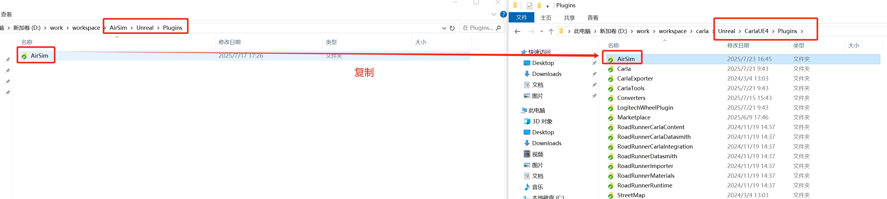
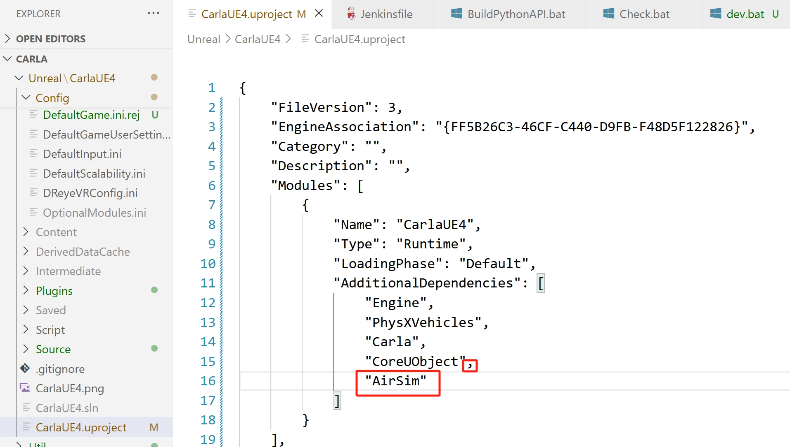
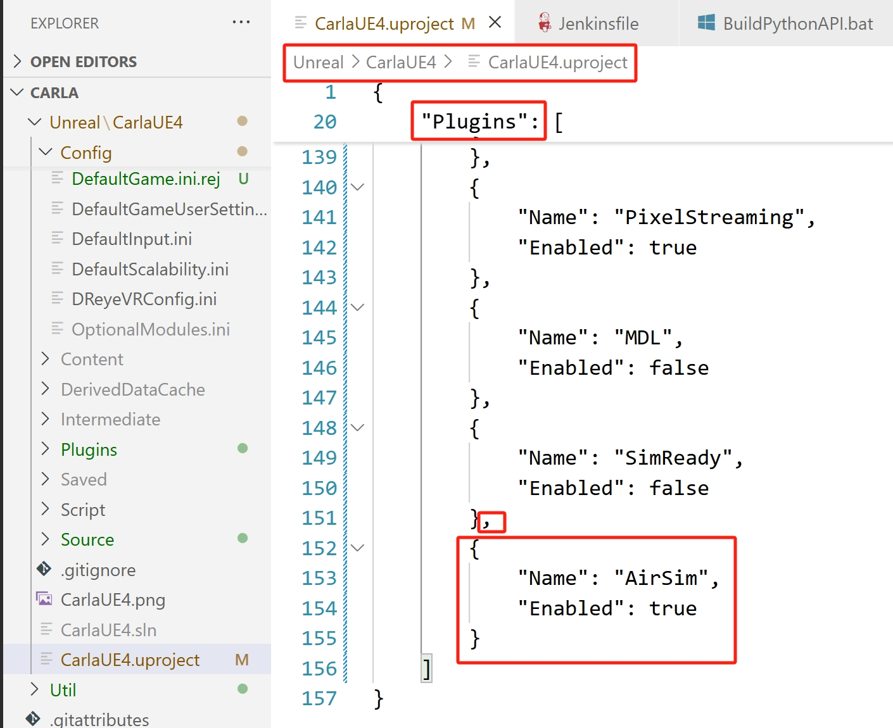
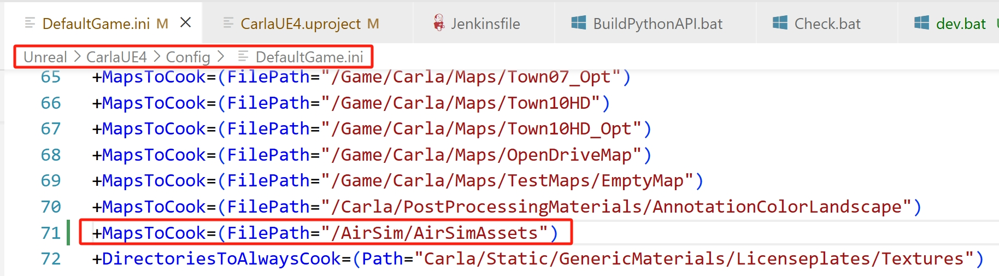

# 添加 AirSim 插件
和 HUTB 一样，使用同一套 [引擎](https://github.com/OpenHUTB/engine) ，构建方法请参考 [从源代码构建链接](https://openhutb.github.io/doc/build_carla/) 。


## 构建 AirSim
* 安装 Visual Studio 2022。**确保**选择使用 **C++ 和 Windows 10 SDK 10.0.19041 进行桌面开发**（默认选择），并在安装 VS 2022 时在“单个组件”选项卡下选择最新的 .NET Framework SDK。 
* 启动 `Developer Command Prompt for VS 2022`.
* 克隆仓库：`git clone https://github.com/OpenHUTB/AirSim.git` ，然后通过 `cd AirSim` 进入 AirSim 目录。

!!! 注意
    通常不建议将 AirSim 安装在 C 盘。这会导致脚本运行失败，并且需要以管理员模式运行 VS。建议将其克隆到其他盘，例如 D 盘或 E 盘。 

* 从命令行运行 `build.cmd` 。这将在 `Unreal\Plugins` 文件夹中创建可立即使用的插件，可将其放入任何虚幻引擎项目中。


!!! 笔记
    构建过程中会弹出`Select Unreal Engine Version`，选择 hutb 所对应的虚幻引擎，会为`AirSim\Unreal\Environments\Blocks.uproject`生成`Blocks.sln`文件。


## 添加插件

下面的步骤是把 AirSim 作为一个插件安装到这个 HUTB 场景工程中。

首先到 AirSim 源码文件夹中找到 `AirSim\Unreal\Plugins` 文件夹（需要编译后才能获得，参考 [在 Windows 上构建 AirSim](../build_windows.md) ），并将`AirSim`文件夹复制到 `hutb\Unreal\CarlaUE4\Plugins` 文件夹中，如下图所示：




然后打开 `hutb\Unreal\CarlaUE4\CarlaUE4.uproject` 文件，修改其中的内容，如下图所示，添加 AirSim 的插件支持。（注意一定要用英文输入法，同时注意不要忘记逗号等分隔符，如果这里修改的有语法错误，则后面可能会出现错误。）修改完之后保存并关闭文件。






使用记事本打开 `hutb\Unreal\CarlaUE4\Config\DefaultGame.ini` 文件，在打包地图的后面添加 `+MapsToCook=(FilePath="/AirSim/AirSimAssets")`，以确保虚幻场景工程可以识别 AirSim 的资源，并将其包含进来，如下图所示。修改后保存并关闭文件。



右键点击 `hutb\Unreal\CarlaUE4\CarlaUE4.uproject` 文件，选择“显示更多选项”，然后选择 `Generate Visual Studio project files` 选项，如下图所示。这一步会自动检测所有的插件和源文件，并且生成 `.sln` 工程文件。


!!! 提示
    如果右键菜单中没有这个选项，那么可以尝试重启电脑，如果仍然没有，可以尝试打开 `CarlaUE4.uproject` 文件，然后点击 `文件` -> `刷新Visual Studio工程`。

<!-- 
生成成功后，双击打开 `CarlaUE4.sln`，在 Visual Studio 中确认编译选项为 `Development Editor` 和 `Win64`，同时 `CarlaUE4` 设为启动项，然后点击 `调试` -> `开始执行`。此时，虚幻引擎编辑器右下角出现了`新插件可用`的提示，说明虚幻引擎已经能够识别到 AirSim 插件了。
-->

执行`make launch`启动虚幻编辑器。
在关卡编辑器中，将右侧 `世界场景设置` 中的 `游戏模式重载` 设置为 `AirSimGameMode`，如下图所示。点击 `保存当前关卡` 来保存设置好的环境，这样以后再次打开时就不用再次设置 `游戏模式重载` 了。


!!! 提示
    如果关卡编辑器右侧没有 `世界场景设置`，则可以点击菜单栏中的 `窗口`，选中 `世界场景设置`。


点击工具栏中的 “运行”，就可以运行仿真了，在跳出的对话框中点 “否”，如下图所示。


点击“是”表示使用AirSim的车，但是 AirSimGameMode 运行时，因Town10HD_Opt 因为是分层地图，建筑没有加载，需要是地图 Town10HD，可以正常显示。

!!! 报错
    如果点运行时提示：`There were no compatible vehicles created for current SimMode! Check your settings.json.`，在菜单中点击`运行` -> `以独立进程运行`则可以显示无人机，但是地图没有显示（从配置文件`C:\Users\Administrator\Documents\AirSim\settings.json`中加载，`"SimMode": "ComputerVision"`）。

如果是第一次仿真运行这个 `Town10` 场景，点击 `运行` 后，视口中一片空白的话（只显示无人机），不要紧张，可能需要一些时间来渲染画面，随着渲染的进行，画面会一点点展示出来。不同性能的计算机的渲染时间也不一样。如果渲染的较长时间的话，也不用担心，因为仅第一次打开的时候需要渲染，第一次渲染完成后，后面的仿真操作就可以直接加载了。渲染完成之后，视口中就会出现一个飞行的四旋翼，如下图所示。点击工具栏的 `停止` 按钮，即可退出仿真。


至此 AirSim 插件已经加载到虚幻引擎场景工程中了。


## FAQ

添加插件后编译报错：
```text
无法打开包括文件: “SplineMeshSceneProxy.h”: No such file or directory
无法打开包括文件: “Renderer/Public/GBufferView.h”: No such file or directory
```
原因：[本地存在多个版本的虚幻引擎，没有使用正确的版本](https://openhutb.github.io/doc/tuto_D_windows_debug/#problems) 。