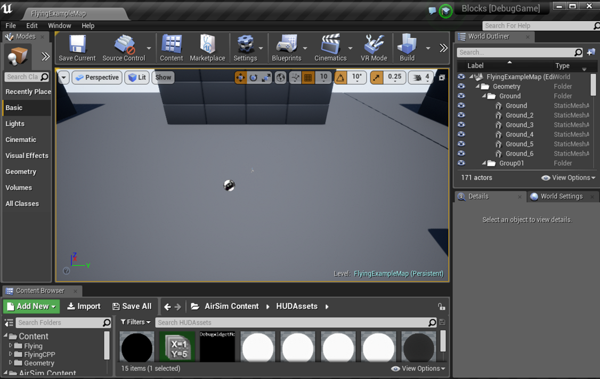

# 图像 API

如果您不熟悉 AirSim API，请先阅读 [通用 API 文档](apis.md) 。

## 获取单张图像

以下示例代码演示如何从名为“0”的摄像头获取单张图像。返回值是 PNG 格式图像的字节数据。要获取未压缩图像和其他格式，以及了解可用的摄像头，请参阅后续章节。

### Python

```python
import airsim # pip install hutb

# 用于汽车的 CarClient()
client = airsim.MultirotorClient()

png_image = client.simGetImage("0", airsim.ImageType.Scene)
# 对图像进行一些操作
```

### C++

```cpp
#include "vehicles/multirotor/api/MultirotorRpcLibClient.hpp"

int getOneImage() 
{
    using namespace msr::airlib;
    
    // 用于汽车的 CarRpcLibClient
    MultirotorRpcLibClient client;

    std::vector<uint8_t> png_image = client.simGetImage("0", VehicleCameraBase::ImageType::Scene);
    // 对图像进行一些操作
}
```

## 以更加灵活的方式获取图像

`simGetImages` API 的使用比 `simGetImage` API 略微复杂一些。例如，您可以通过一次 API 调用获取左侧摄像头视图、右侧摄像头视图以及左侧摄像头的深度图像。`simGetImages` API 还允许您获取未压缩的图像以及单通道浮点图像（而不是 3 通道 (RGB)，每个通道 8 位）。


### Python

```python
import airsim  # pip install hutb

# 用于汽车的 CarClient()
client = airsim.MultirotorClient()

responses = client.simGetImages([
    # png 格式
    airsim.ImageRequest(0, airsim.ImageType.Scene), 
    # 未压缩的 RGB 数组字节
    airsim.ImageRequest(1, airsim.ImageType.Scene, False, False),
    # 浮点未压缩图像
    airsim.ImageRequest(1, airsim.ImageType.DepthPlanar, True)])
 
 # 对包含图像数据、姿态、时间戳等信息的响应进行处理
```

#### 使用 NumPy 处理 AirSim 图像

如果您计划使用 numpy 进行图像处理，您应该获取未压缩的 RGB 图像，然后像这样将其转换为 numpy 格式：

```python
responses = client.simGetImages([airsim.ImageRequest("0", airsim.ImageType.Scene, False, False)])
response = responses[0]

# 获取 NumPy 数组
img1d = np.fromstring(response.image_data_uint8, dtype=np.uint8) 

# 将数组重塑为 4 通道图像数组（高 x 宽 x 4）。
img_rgb = img1d.reshape(response.height, response.width, 3)

# 原图已垂直翻转
img_rgb = np.flipud(img_rgb)

# 写入 png
airsim.write_png(os.path.normpath(filename + '.png'), img_rgb) 
```

#### 快速提示
- API `simGetImage` 返回二进制`字符串字面量`，这意味着您可以直接将其导出为二进制文件以创建 .png 文件。但是，如果您想以其他方式处理它，可以使用便捷的函数 `airsim.string_to_uint8_array`。该函数将二进制字符串字面量转换为 NumPy uint8 数组。 

- API `simGetImages` 可以在一次调用中接受来自任何摄像头的多种图像类型的请求。您可以指定图像是 PNG 压缩图像、RGB 未压缩图像还是浮点数组。对于 PNG 压缩图像，您将获得一个`二进制字符串字面量`。对于浮点数组，您将获得一个 Python float64 列表。您可以使用以下方法将此浮点数组转换为 NumPy 二维数组： 
    ```
    airsim.list_to_2d_float_array(response.image_data_float, response.width, response.height)
    ```
    您还可以使用 `airsim.write_pfm()` 函数将浮点数组保存到 .pfm 文件（便携式浮点映射格式）。 

- 如果您希望在调用图像 API 时同步查询位置和方向信息，可以使用 `client.simPause(True)` 和 `client.simPause(False)` 在调用图像 API 和查询所需物理状态时暂停模拟，以确保在调用图像 API 后物理状态立即保持不变。 

### C++

```cpp
int getStereoAndDepthImages() 
{
    using namespace msr::airlib;
    
    typedef VehicleCameraBase::ImageRequest ImageRequest;
    typedef VehicleCameraBase::ImageResponse ImageResponse;
    typedef VehicleCameraBase::ImageType ImageType;

    // 用于汽车
    // CarRpcLibClient client;
    MultirotorRpcLibClient client;

    // 获取右图、左图和深度图。前两张图为 PNG 格式，后两张图为 float16 格式。
    std::vector<ImageRequest> request = { 
        //png 格式
        ImageRequest("0", ImageType::Scene),
        // 未压缩的 RGB 数组字节
        ImageRequest("1", ImageType::Scene, false, false),       
        // 浮点未压缩图像
        ImageRequest("1", ImageType::DepthPlanar, true) 
    };

    const std::vector<ImageResponse>& response = client.simGetImages(request);
    // 对包含图像数据、姿态、时间戳等信息的响应进行处理
}
```

## 可直接运行的完整示例

### Python

如需更完整的可直接运行的示例代码，请参阅 AirSimClient 项目中的多旋翼飞行器 [示例代码](https://github.com/OpenHUTB/air/tree/main/PythonClient//multirotor/hello_drone.py) 或 [HelloCar 示例代码](https://github.com/OpenHUTB/air/tree/main/PythonClient//car/hello_car.py) 。这些代码还演示了一些简单的操作，例如将图像保存到文件或使用 `numpy` 处理图像。


### C++

如需更完整的可运行 [示例代码](https://github.com/OpenHUTB/air/tree/main/HelloDrone//main.cpp) ，请参阅 HelloDrone 多旋翼飞行器项目或 [HelloCar 项目的示例代码](https://github.com/OpenHUTB/air/tree/main/HelloCar//main.cpp) 。

另请参阅[其他示例代码](https://github.com/OpenHUTB/air/tree/main/Examples/DataCollection/StereoImageGenerator.hpp)，该代码生成指定数量的立体图像以及真实深度和视差，并将其保存为 [pfm 格式](pfm.md) 。


## 可用的相机

这些是每辆车默认配备的摄像头。除此之外，您还可以通过 [设置](settings.md) 为车辆添加更多摄像头，以及添加未安装在任何车辆上的外部摄像头。

### 汽车

可以通过 API 调用以下名称访问车载摄像头： `front_center`、`front_right`、`front_left`、`fpv` 和 `back_center`。其中，FPV 摄像头显示的是驾驶员在车内的头部位置。

### 多旋翼飞行器
可以通过 API 调用中的以下名称访问无人机上的摄像头： `front_center`、`front_right`、`front_left`、`bottom_center` 和 `back_center`。

### 计算机视觉模式

相机名称与多旋翼飞行器中的相同。

### 相机名称的向后兼容性

在 AirSim v1.2 之前，摄像机是通过 ID 号而非名称来访问的。为了向后兼容，您仍然可以按上述顺序使用以下 ID 号访问上述摄像机名称：`"0"`, `"1"`, `"2"`, `"3"`, `"4"`。此外，摄像机名称`""`也可以用于访问默认摄像机，通常为摄像机`"0"`。

## "计算机视觉" 模式

您可以在所谓的“计算机视觉”模式下使用 AirSim。在此模式下，物理引擎将被禁用，并且没有飞行器，只有摄像头（如果您想要飞行器但不包含其运动学特性，可以使用多旋翼模式和物理引擎 [ExternalPhysicsEngine](settings.md##physicsenginename) ）。您可以使用键盘移动（使用 F1 查看按键帮助）。您可以按下录制按钮来连续生成图像。或者，您可以调用 API 来移动摄像头并拍摄图像。


要激活此模式，请编辑您可以在 Documents\AirSim 文件夹（或 Linux 上的 ~/Documents/AirSim）中找到的 [settings.json](settings.md)，并确保根级别存在以下值：

```json
{
  "SettingsVersion": 1.2,
  "SimMode": "ComputerVision"
}
```

以下是移动摄像头并拍摄图像的 [Python 代码示例](https://github.com/OpenHUTB/air/tree/main/PythonClient//computer_vision/cv_mode.py) 。

此模式受到 [UnrealCV 项目](http://unrealcv.org/) 的启发。


### 在计算机视觉模式下设置姿态

要使用 API 在环境中移动，可以使用 `simSetVehiclePose` API。此 API 接收位置和方向信息，并将其设置到位于车辆中心前方的摄像头所在的不可见车辆上。所有其他摄像头都会保持相对位置并随之移动。如果您不想改变位置（或方向），只需将位置（或方向）分量设置为浮点 NaN 值即可。`simGetVehiclePose` 允许您检索当前姿态。您还可以使用 `simGetGroundTruthKinematics` 获取运动的运动学参数。此外，还有许多其他非车辆专用 API 可用，例如分割 API、碰撞 API 和摄像头 API。

## 相机 API

`simGetCameraInfo` 函数返回指定相机的位姿（世界坐标系，NED 坐标，SI 单位）和视场角（以度为单位）。请参阅 [示例用法](https://github.com/OpenHUTB/air/tree/main/PythonClient//computer_vision/cv_mode.py) 。

`simSetCameraPose` 函数用于设置指定摄像机的姿态，其输入姿态为相对位置和 NED 坐标系中的四元数的组合。`airsim.to_quaternion()` 函数可以将俯仰角、横滚角和偏航角转换为四元数。例如，要将 camera-0 的俯仰角设置为 15 度，同时保持其位置不变，可以使用以下方法：
```
camera_pose = airsim.Pose(airsim.Vector3r(0, 0, 0), airsim.to_quaternion(0.261799, 0, 0))  #PRY in radians
client.simSetCameraPose(0, camera_pose);
```

- `simSetCameraFov` 允许在运行时更改相机的视野。
- `simSetDistortionParams` 和 `simGetDistortionParams` 函数允许设置和获取失真参数 K1、K2、K3、P1 和 P2。 


除了 API 特有的参数外，所有相机 API 都接受 3 个通用参数：`camera_name(str)`、`vehicle_name(str)` 和 `external`(bool, 指示是否为 [外部相机](settings.md#external-cameras) )。`camera_name` 和 `vehicle_name` 用于获取特定的摄像头；如果 `external` 设置为 `true`，则忽略车辆名称。有关这些 API 的示例用法，请参阅 [external_camera.py](https://github.com/OpenHUTB/air/blob/main/PythonClient/computer_vision/external_camera.py) 文件。


### 云台
您可以 [使用设置](settings.md#gimbal) 为任何相机设置俯仰、横滚或偏航的稳定性。

请参阅 [使用示例](https://github.com/OpenHUTB/air/tree/main/PythonClient/computer_vision/cv_mode.py) 。


## 更改分辨率和相机参数
要更改分辨率、视场角 (FOV) 等参数，您可以使用 [settings.json](settings.md) 文件。例如，以下添加到 settings.json 文件中的设置将设置场景捕获的参数，并使用上述“计算机视觉”模式。如果您省略任何设置，则将使用以下默认值。更多信息请参阅 [设置文档](settings.md) 。如果您使用的是立体相机，目前左右两侧的距离固定为 25 厘米。

```json
{
  "SettingsVersion": 1.2,
  "CameraDefaults": {
      "CaptureSettings": [
        {
          "ImageType": 0,
          "Width": 256,
          "Height": 144,
          "FOV_Degrees": 90,
          "AutoExposureSpeed": 100,
          "MotionBlurAmount": 0
        }
    ]
  },
  "SimMode": "ComputerVision"
}
```

## 不同图像类型中的像素值分别代表什么？
### 可用的图像类型(ImageType)值
```cpp
  Scene = 0, 
  DepthPlanar = 1, 
  DepthPerspective = 2,
  DepthVis = 3, 
  DisparityNormalized = 4,
  Segmentation = 5,
  SurfaceNormals = 6,
  Infrared = 7,
  OpticalFlow = 8,
  OpticalFlowVis = 9
```                

### DepthPlanar 和 DepthPerspective
通常情况下，您需要以浮点数形式获取深度图像（即设置 `pixels_as_float = true`），并在 `ImageRequest` 中指定 `ImageType = DepthPlanar` 或 `ImageType = DepthPerspective`。对于 `ImageType = DepthPlanar`，您将获得相机平面上的深度，也就是说，所有与相机平面平行的点都具有相同的深度。对于 `ImageType = DepthPerspective`，您将使用投射到该像素的光线从相机获取深度。根据您的具体应用场景，平面深度或透视深度可能就是您需要的真实深度图像。例如，您可以将透视深度提供给 ROS 包（例如 `depth_image_proc`）来生成点云。或者，平面深度可能与立体算法（例如 SGM）生成的估计深度图像更兼容。

### DepthVis
在 `ImageRequest` 中指定 `ImageType = DepthVis` 时，您将获得一张用于深度可视化的图像。在这种情况下，每个像素值都会根据相机平面上的深度（以米为单位）进行插值，从黑色到白色。纯白色像素表示深度为 100 米或更深，而纯黑色像素表示深度为 0 米。

### DisparityNormalized

通常情况下，您希望以浮点数形式检索视差图像（即在 `ImageRequest` 中设置 `pixels_as_float = true` 并指定 `ImageType = DisparityNormalized`），在这种情况下，每个像素都是 `(Xl - Xr)/Xmax`，从而被归一化为 0 到 1 之间的值。


### 分割 Segmentation

在 `ImageRequest` 中指定 `ImageType = Segmentation` 时，您将获得一张图像，其中包含场景的真实分割结果。启动时，AirSim 会为环境中每个可用的网格分配 0 到 255 的值。然后，该值会映射到 [调色板](https://github.com/OpenHUTB/air/blob/main/Unreal/Plugins/AirSim/Content/HUDAssets/seg_color_palette.png) 中的特定颜色。每个对象 ID 的 RGB 值都可以在 [此文件](seg_rgbs.txt) 中找到。

您可以使用 API 为特定网格分配一个特定值（范围为 0-255）。例如，以下 Python 代码将 Blocks 环境中名为“Ground”的网格的对象 ID 设置为 20，从而更改其在分割视图中的颜色：

```python
success = client.simSetSegmentationObjectID("Ground", 20);
```

返回值是一个布尔类型，用于告知您是否找到了网格。

!!! 注意
    典型的虚幻引擎环境（例如方块）通常包含许多由相同对象构成的网格，例如“Ground_2”、“Ground_3”等等。由于为所有这些网格设置对象 ID 非常繁琐，AirSim 也支持正则表达式。例如，以下代码只需一行即可将所有名称以“ground”（忽略大小写）开头的网格的 ID 设置为 21：

```python
success = client.simSetSegmentationObjectID("ground[\w]*", 21, True);
```

如果使用正则表达式匹配至少找到一个网格，则返回值为真。

建议您使用此 API 请求未压缩的图像，以确保获得精确的分割图像 RGB 值：
```python
responses = client.simGetImages([ImageRequest(0, AirSimImageType.Segmentation, False, False)])
img1d = np.fromstring(response.image_data_uint8, dtype=np.uint8) # 获取 numpy 数组
img_rgb = img1d.reshape(response.height, response.width, 3) # reshape array to 3 channel image array H X W X 3
img_rgb = np.flipud(img_rgb) #original image is fliped vertically

#find unique colors
print(np.unique(img_rgb[:,:,0], return_counts=True)) #red
print(np.unique(img_rgb[:,:,1], return_counts=True)) #green
print(np.unique(img_rgb[:,:,2], return_counts=True)) #blue  
```

[segmentation.py](https://github.com/OpenHUTB/air/tree/main/PythonClient//computer_vision/segmentation.py) 中提供了一个完整的可运行示例。

#### 取消设置对象 ID
可以将对象的 ID 设置为 -1，使其不显示在分割图像上。

#### 如何查找网格名称？
为了获得所需的真实分割结果，您需要知道虚幻引擎环境中网格的名称。为此，您需要在虚幻编辑器中打开虚幻环境，然后使用世界大纲视图查看您感兴趣的网格名称。例如，下图显示了编辑器右侧面板中“方块(Blocks)”环境中地面网格的名称：



如果您不知道如何在虚幻编辑器中打开虚幻环境，请尝试按照 [从源代码构建](build_windows.md) 的指南进行操作。

确定所需的网格后，记下它们的名称，并使用上述 API 设置它们的对象 ID。有 [一些设置](settings.md#segmentation-settings) 可以更改对象 ID 的生成方式。


#### 更改对象 ID 的颜色
目前，每个对象 ID 的颜色都固定为 [该调色板](https://github.com/microsoft/AirSim/blob/main/Unreal/Plugins/AirSim/Content/HUDAssets/seg_color_palette.png) 中所示的颜色。我们将很快添加自定义对象 ID 颜色的功能。在此期间，您可以使用您常用的图像编辑器打开分割图像，并获取您所需的 RGB 值。

#### 启动对象 ID

启动时，AirSim 会为环境中所有类型为 `UStaticMeshComponent` 或 `ALandscapeProxy` 的对象分配一个对象 ID。然后，它会根据设置，使用网格名称或所有者名称，将其转换为小写，移除 ASCII 码 97 以下的所有字符（包括数字和部分标点符号），将所有字符的整数值相加，然后取模 255，从而生成对象 ID。换句话说，所有包含相同字母的对象都会获得相同的对象 ID。这种启发式方法简单有效，适用于许多虚幻引擎环境，但可能并非您所需。在这种情况下，请使用上述 API 将对象 ID 更改为您所需的值。有 [一些设置](settings.md#segmentation-settings) 可用于更改此行为。


#### 获取网格对象的 ID
`simGetSegmentationObjectID` API 允许您获取给定网格名称的对象 ID。

### 红外

目前这只是一个从对象 ID 到灰度值 0-255 的映射。因此，任何对象 ID 为 42 的网格都会显示为颜色 (42, 42, 42)。有关如何设置对象 ID 的更多详细信息，请参阅 [分割部分](#segmentation) 。通常，可以对这种图像类型应用噪声设置，以获得更逼真的效果。我们仍在努力添加其他红外伪影，欢迎任何贡献。

### 光流(OpticalFlow) 和光流可视化(OpticalFlowVis)
这些图像类型返回有关摄像机视角所感知到的运动信息。OpticalFlow 返回一个双通道图像，其中两个通道分别对应于 vx 和 vy。OpticalFlowVis 与 OpticalFlow 类似，但它将流数据转换为 RGB 格式，以获得更直观的输出。

## 示例代码

[GenerateImageGenerator.hpp](https://github.com/OpenHUTB/air/tree/main/Examples/DataCollection/StereoImageGenerator.hpp) 文件提供了一个完整的示例，演示如何将车辆位置和方向随机设置，然后拍摄图像。该示例生成指定数量的立体图像和真实视差图像，并将其保存为 [pfm 格式](pfm.md) 。

