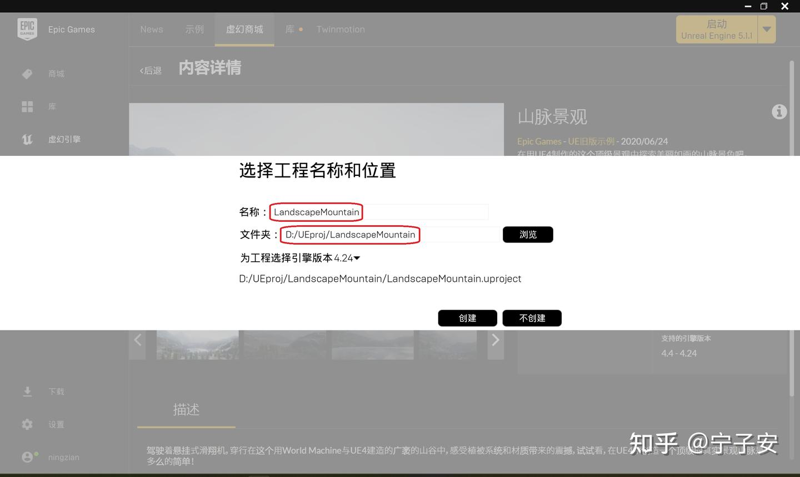
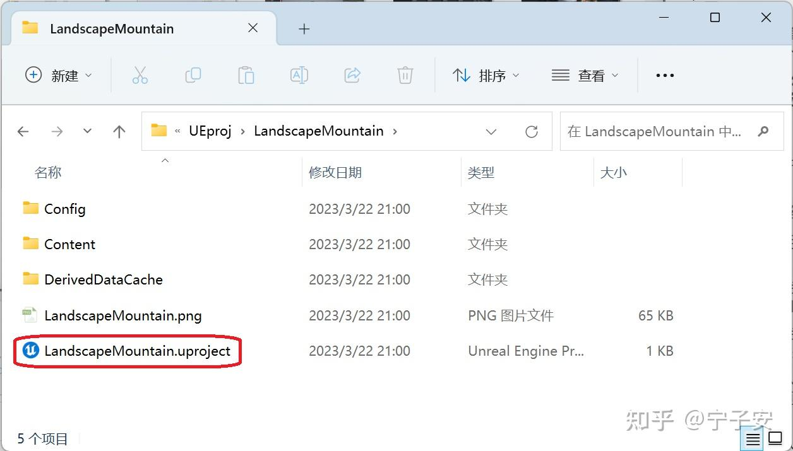
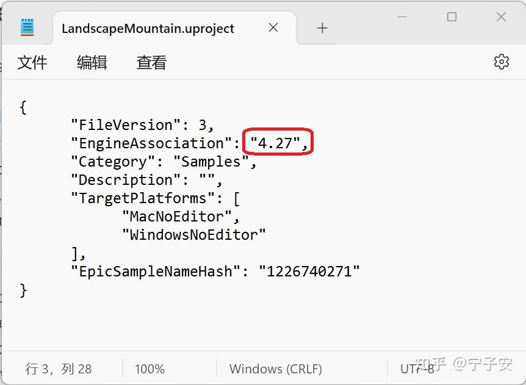
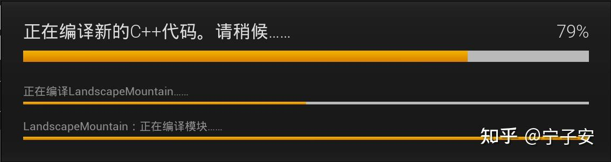
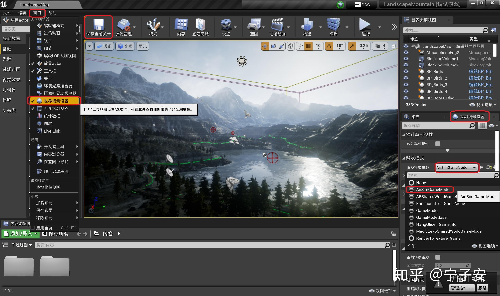
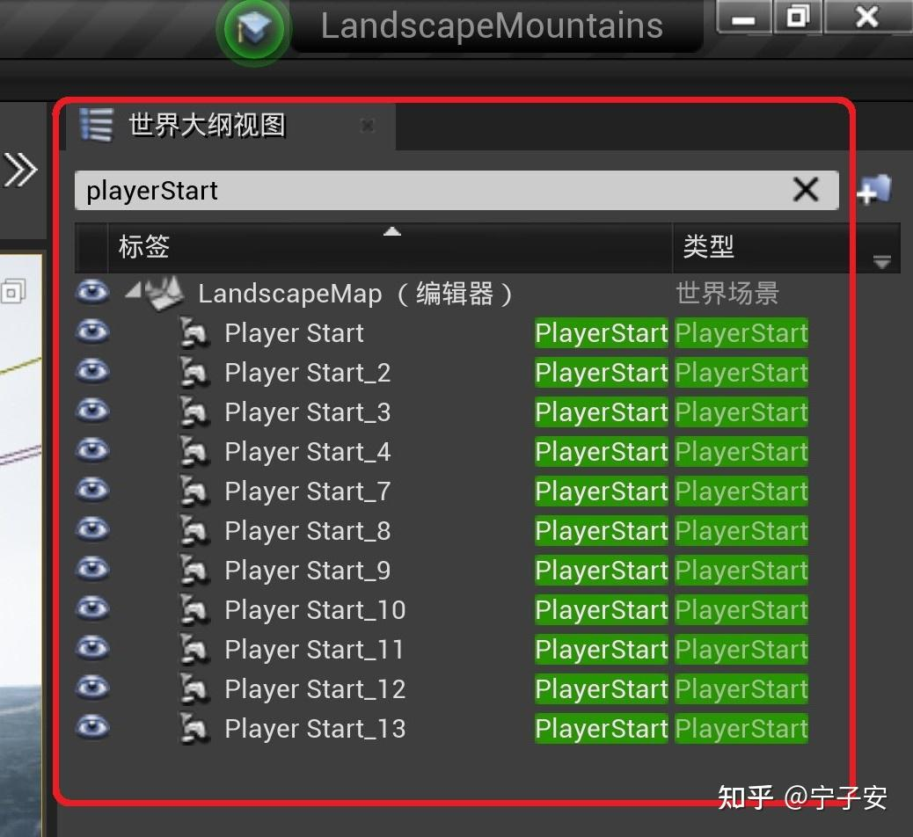
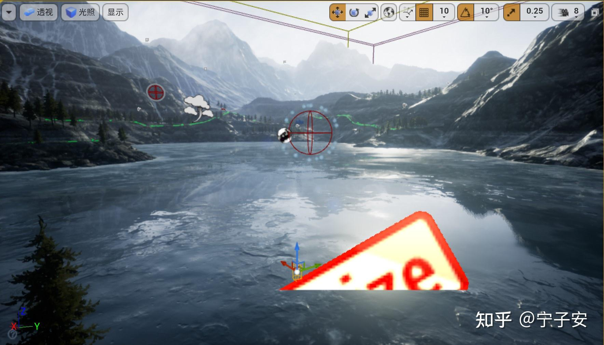
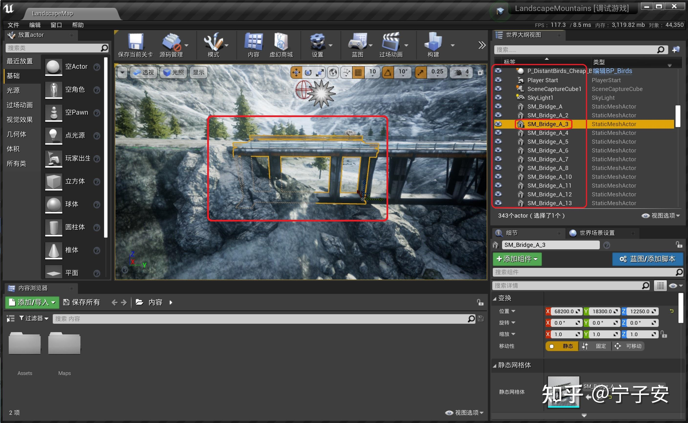

# 山脉景观

## 使用虚幻商城中的场景工程

### 下载安装“山脉景观”场景工程

“山脉景观” 是非常经典的官方教学用虚拟场景，它包含了完整的虚幻引擎工程文件，它可以在 Epic Games 启动程序中免费下载和安装。本节的实例以 “山脉景观” 场景为例，详细讲解如何使用虚幻商城中第一类已有完整工程文件的场景。同时设置 CV Mode 模式，在新建的场景中自由浏览，初步感受一下虚幻引擎中逼真的视觉渲染效果。

点击 [fab](https://www.fab.com/zh-cn/) 中的 [LandscapeMountains场景链接](https://www.fab.com/zh-cn/listings/5d47ae85-ff9b-4e9a-af30-95f23ffc0782) ，并添加到我的库中（需要登录），然后点击`在启动器中查看`，如下图所示。

打开之后，在`库`中的`Fab Library`中点击 `LandscapeMountains` 下的“创建工程”（如果未显示则需要点击`Fab Library`旁的刷新按钮）。注意，这里的工程名称和文件夹路径都不能包含中文字符，一定要改成英文的，如下图所示。点击 “创建” 即可自动下载整个工程附件并创建好工程。注意这里的为工程选择引擎版本最高仅支持到 4.24，所以必须要安装 4.24 版本的虚幻引擎才可以下载安装 “山脉景观” 场景。

 

创建工程时的路径和命名中不能包含中文字符

在 Epic Games 启动程序的左下角有个 “下载” 按钮，这里可以看到当前下载和安装的进度等详细信息。下载安装完成后，就会在刚刚选好的安装路径中自动创建好 “LandscapeMountains” 文件夹，这里包含了这个工程的所有文件，如下图所示。

山脉景观工程文件夹中 uproject 工程文件

其中的文件`LandscapeMountains.uproject`的文件格式 `.uproject`是虚幻引擎的工程文件默认格式。每个项目工程都有一个与之对应 `.uproject`文件，它是你创建、打开或保存工程必须用到的文件。

“山脉景观” 场景最高仅支持到虚幻引擎 4.24 版本，如果没有安装 4.24 版本的虚幻引擎，则是无法打开的。因为虚幻引擎 4.27 版本向下兼容，可以打开 4.24 版本的工程文件，所以需要将 “山脉景观” 工程需要的虚幻引擎版本手动设置为 4.27。右击 `LandscapeMountains.uproject` 文件，打开方式中选择用记事本打开，将其中的 `EngineAssociation` 设置为 “4.27”，如下所示。

修改 uproject 工程文件中的引擎版本

修改完并保存后，双击文件 `LandscapeMountains.uproject`，则会自动打开虚幻引擎 4.27 版本的关卡编辑器。

因为虚幻引擎要求每个工程至少有一个源文件才能进行编译，所以我们需要首先新建一个 C++ 类，这样才能正常创建 Visual Studio 的`.sln`工程文件。点击左上角菜单栏的 “文件”，选择 `新建C++类`。如下图所示。

新建的工程需要添加C++类

在弹出的对话框中，父类默认选择 “无”，点击下一步，如下图所示：

命名和路径都保持默认即可（注意这里不能有中文字符），最后点击 `创建类`。这时虚幻引擎会自动编译C++代码，在当前工程文件夹下生成名为 `LandscapeMountains.sln` 的 Visual Studio 工程文件，同时会自动打开 Visual Studio 2022。

此时不要直接关闭 Visual Studio 2022，要等待其后台处理完成后才能关闭。点击左下角的小方框即可看到此时的后台有没有在处理过程中，下图展示的是 Visual Studio 2022 的后台正在进行分析代码。同时注意要把编译模式设置为 `DebugGame Editor` 和 `Win64`。另外右侧的解决方案管理器中，要把 `LandscapeMountain` 设置为启动项目（具体如何设置参见 1.3.3 节）。

至此 `山脉景观` 场景工程创建完成。可以把 Visual Studio 和虚幻引擎都关闭了，来准备下一节添加 AirSim 插件。

### 添加 AirSim 插件

有了虚幻场景工程，还不能做仿真，下面的步骤是把 AirSim 作为一个插件安装到这个场景工程中。

首先到 AirSim 源码文件夹中找到 `AirSim\Unreal\Plugins` 文件夹（需要编译后才能获得，1.3.2节），并将其复制到 `LandscapeMountains` 文件夹中，如下图所示：

然后用记事本打开 `LandscapeMountain.uproject` 文件，修改其中的内容，如下图所示，添加 AirSim 的插件支持。（注意一定要用英文输入法，同时注意不要忘记逗号等分隔符，如果这里修改的有语法错误，则后面可能会出现错误。）修改完之后保存并关闭文件。

使用记事本打开 `LandscapeMountains\Config\DefaultGame.ini` 文件，在最后一行添加 `+MapsToCook=(FilePath="/AirSim/AirSimAssets")`，以确保虚幻场景工程可以识别 AirSim 的资源，并将其包含进来，如下图所示。修改后保存并关闭文件。

右键点击 `LandscapeMountains.uproject` 文件，选择“显示更多选项”，然后选择 `Generate Visual Studio project files` 选项，如下图所示。这一步会自动检测所有的插件和源文件，并且生成 `.sln` 工程文件。

!!! 提示
    如果右键菜单中没有这个选项，那么可以尝试重启电脑，如果仍然没有，可以尝试打开 `LandscapeMountains.uproject` 文件，然后点击 `文件` -> `刷新Visual Studio工程`。

生成成功后，双击打开 `LandscapeMountains.sln`，在 Visual Studio 中设置编译选项为 `DebugGame Editor` 和 `Win64`，同时将 `LandscapeMountains` 设为启动项，如 2.4 节设置 Block 环境时一样。等待Visual Studio 后台处理完成后，点击 `调试` -> `开始调试`，或者直接点击 `本地 Windows 调试器`，这时会自动打开虚幻引擎的关卡编辑器。此时，虚幻引擎编辑器右下角出现了`新插件可用`的提示，说明虚幻引擎已经能够识别到 AirSim 插件了。

在关卡编辑器中，将右侧 `世界场景设置` 中的 `游戏模式重载` 设置为 `AirSimGameMode`，如下图所示。点击 `保存当前关卡` 来保存设置好的环境，这样以后再次打开时就不用再次设置 `游戏模式重载` 了。

!!! 提示
    如果关卡编辑器右侧没有 `世界场景设置`，则可以点击菜单栏中的 `窗口`，选中 `世界场景设置`。

点击工具栏中的 “运行”，就可以运行仿真了，在跳出的对话框中点 “否”，如下图所示。

如果是第一次仿真运行这个 `山脉景观` 场景，点击 `运行` 后，视口中一偏空白的话，不要紧张，可能需要一些时间来渲染画面，随着渲染的进行，画面会一点点展示出来。不同性能的计算机的渲染时间也不一样。如果渲染的较长时间的话，也不用担心，因为仅第一次打开的时候需要渲染，第一次渲染完成后，后面的仿真操作就可以直接加载了。渲染完成之后，视口中就会出现一个飞行的四旋翼，如下图所示。点击工具栏的 `停止` 按钮，即可退出仿真。

至此 AirSim 插件已经加载到虚幻引擎场景工程中了。

## 实例1：浏览游戏中的美景

### 设置为 CV Mode
上一节运行仿真时，是在开始时选择无人机或者无人机车仿真模式。除了这种方式外，还有一种可以提前设置仿真模式的方法。AirSim在仿真启动时会自动读取 `C:\Users\用户名\Documents\AirSim` 文件夹下面的 `settings.json` 文件内容，并进行初始化设置，如下图所示。电脑第一次运行AirSim时应该会自动创建这个文件，如果没有的话，需要手动创建。在以后的仿真学习中，我们会经常使用到这个设置文件。

AirSim 的仿真模式有3种，除了四旋翼无人机仿真和无人车仿真，还有一种是 `Computer Vision` 模式。在这种模式下，仿真中没有任何无人机或无人车，也没有动力学模型，但是可以用键盘控制视角，或者也可以使用 APIs 来控制相机的位置和角度，以此来收集很多图片作为数据集。

可以添加或修改 `settings.json` 中的内容，来手动修改 AirSim 的一些默认设置。使用写字板打开 `settings.json` 文件，添加 `SimMode` 标签和内容（其他已有的内容不需要修改），如下图所示。

这里的 `SimMode` 标签就是设置 AirSim 的仿真模式，如果想做多旋翼无人机仿真，就设置成 `Multirotor`，如果想做无人车仿真，就设置成 `Car`。本节我们体验一下 `Computer Vision` 仿真模式。修改好之后，保存并关闭文件。

在虚幻引擎的关卡编辑器中，点击上方工具栏的 `运行`，跟之前不一样的是，此时没有了询问是否选择无人机车的窗口，而是直接开始仿真。视口中没有任何无人机和无人车。将鼠标移动到视口中并点击鼠标左键，此时就进入了浏览模式。在浏览模式下，鼠标是不显示且不能移动的，键盘上同时按 `Shift + F1` 则可以退出浏览模式。所以要想停止仿真或者关闭窗口等操作，都需要先退出浏览模式。

### 设置初始位置
在仿真开始的时候，视口中所处的场景中的位置是在比较高的高空中，使用键盘移动的话，很久才能移动到地面上。如果使用无人机仿真，在仿真开始的时候，无人机是在半空中，会直接往下掉，所以需要将初始位置放置到一个合适的地面上。

在 `世界大纲视图` 中搜索 `Player Start`，可以发现有好几个类似名字的 Actor，如下图所示。

`Player Start` Actor 在虚幻引擎中是 `玩家出生点` 的设置，是指在游戏世界场景中玩家开始游戏的地点。在 AirSim 仿真中，会自动读取这个位置，然后将仿真开始时将初始位置设置在这个点。我们只需要修改这个点的位置，即可控制 AirSim 仿真的初始位置。

`山脉景观` 场景中有14个 `Player Start` Actor，可以只留下第一个，将其他的都删除掉。首先要退出仿真，双击 `Player Start` Actor，视口中会自动移动到此 `Player Start` Actor 所在的位置，如下图所示。

设置初始位置

右下角参数面板中的 `位置` 可以设置 `Player Start` 在虚幻引擎场景中的位置，可以直接修改坐标来改变其位置，这里的坐标是虚幻引擎世界坐标系下的坐标，修改起来非常麻烦。还有一种方法，将鼠标放在在中间的白点或者红绿蓝三个坐标轴上时，就可以用鼠标左键拖动 `Player Start` Actor了。将其移动到期望的位置，然后保存当前关卡。修改完成后，点击 `运行`，仿真开始的位置就是刚刚修改的位置。

如果出现 `BAD Size` 标识，如下图所示，说明此初始位置与其他 Actor 发生了碰撞，需要将其移出。

### 视角控制
在浏览模式中，视角是可以控制的，视角的运动包括3个方向的平移运动（上下、左右、前后）和2个方向的旋转运动（俯仰、偏航）。使用键盘可以控制视角完成自由运动，键盘按键与视角运动的对应如下：

* 上下箭头按键：控制视角前后平移运动
* 左右箭头按键：控制视角左右平移运动
* PgUp、PgDn：控制视角上下平移移动
* W、S按键：控制视角俯仰旋转运动
* A、D按键：控制视角偏航旋转运动

在关卡编辑器中点击 `运行` 后，把鼠标移动到中间的视口中，点击鼠标左键，即可进入浏览模式，此时就可以用键盘自由地控制视角在场景中移动，浏览美景。在浏览模式中，鼠标是不能移出视口的，更不能点击视口以外的按钮，当需要退出时，需要同时按键盘上的 `Shift + F1` 键，即可退出浏览模式。

### Actor 参数调节
场景是由很多的 Actor 组成的，其中的山、路、云、树木等都可以看做是一个 Actor，例如下图中所示，`山脉景观` 场景中一段桥梁就是一个 Actor。每个 Actor 都有其相应的参数，如位置信息等，这些参数都可以调整。

原始的 `山脉景观` 场景中有比较大的雾气，影响了浏览美景的视野，只需要将雾气有关的 Actor 的雾密度参数调低就可以减小雾气的浓度。

在关卡编辑器右侧的 `世界大纲视图` 中搜索 `fog`，搜索出来两个跟雾气有关的 Actor，（只有在仿真进行中才会有 `ExponentialHeightFog`）。点击选中 `ExponentialHeightFog` Actor，将参数面板的 `雾密度` 参数设为 0，如下图所示。这时在仿真中视野可见度会好很多，景色也会更美。关于天气的控制，后续会有更详细的介绍。

后续可以使用这样的方法调节各种 Actor 的参数，来达到自己想要的效果。

## 参考

* [开始使用 AirSim](https://zhuanlan.zhihu.com/p/619214564)

