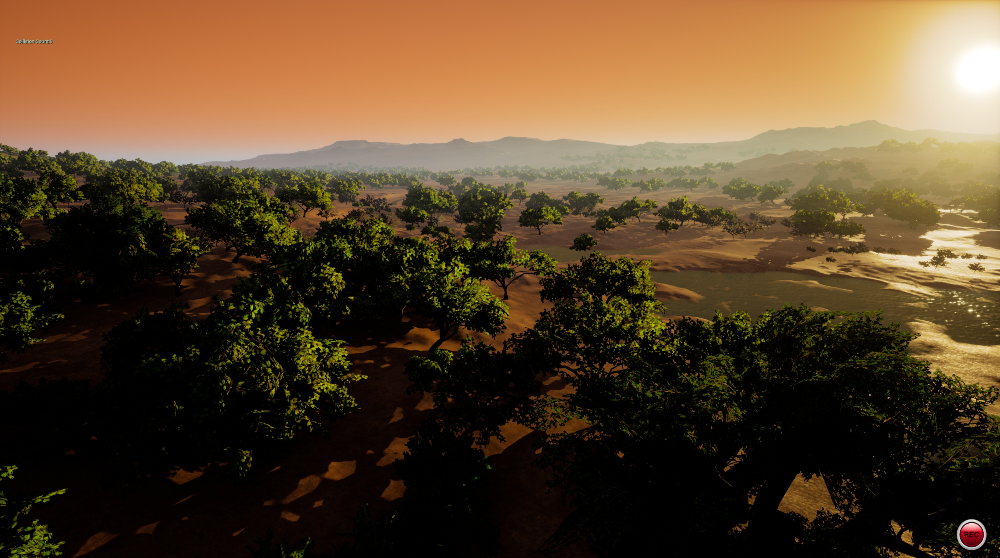
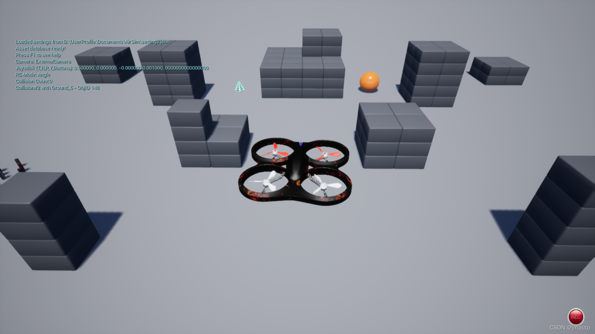
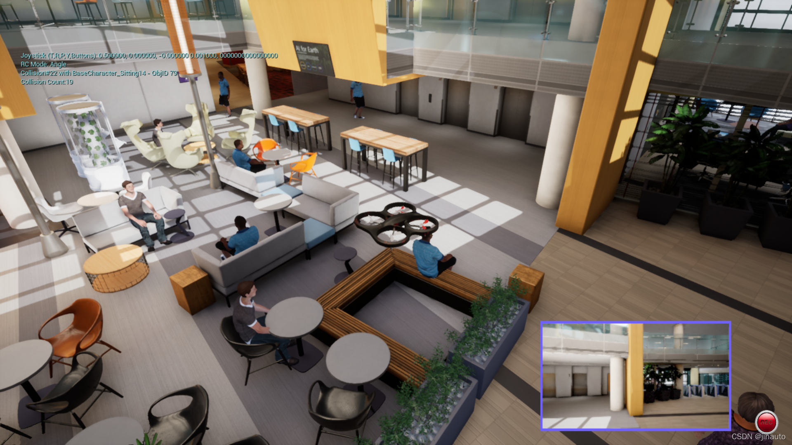

# 自带的地图列表

1.AbandonedPark （失落的公园）

2.Africa (非洲：崎岖不平的地形和活泼的动物)

3.AirSimNH (小型城市街区, small urban neighborhood block)

4.Blocks ——几个方块

5.Building_99 —— 办公楼里

6.CityEnviron ——城市环岛，有人，车

7.Coastline  —— 海岸线风景

8.LandscapeMountains —— 雪山，有圆环，像是无人机比赛地图

9.MSBuild2018 (soccer field) —— 一个足球场周边建筑，应该是微软的办公园区

10.TrapCamera（干草原：DryGrassLand）

11.ZhangJiajie ——张家界，云山雾绕的仙境一般

## 参考

* [AirSim无人机仿真——手柄操作](https://blog.csdn.net/jinauto/article/details/124048955)

