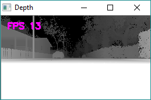
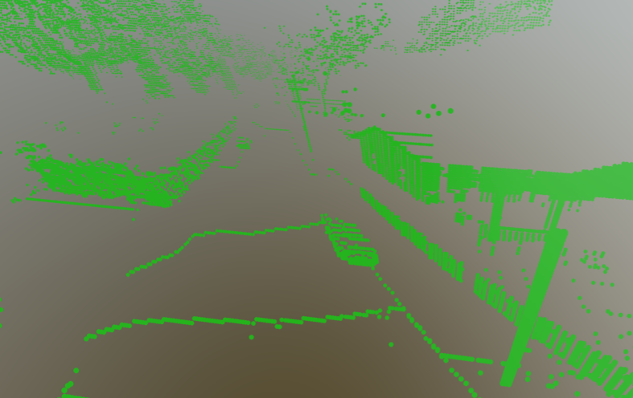

# 点云

已从 [wiki 页面](https://github.com/microsoft/AirSim/wiki/Point-Clouds) 迁移至此处。

Python 脚本 [point_cloud.py](https://github.com/OpenHUTB/air/blob/main/PythonClient/multirotor/point_cloud.py) 展示了如何将从 AirSim 返回的深度图像转换为点云。

以下深度图像是使用模块化街区(Modular Neighborhood)环境捕获的：

使用合适的投影矩阵，OpenCV 的 `reprojectImageTo3D` 函数可以将其转换为点云。以下是结果，也可在此处查看：[https://skfb.ly/68r7y](https://skfb.ly/68r7y)。

[SketchFab](https://sketchfab.com) 可以上传生成的 `cloud.asc` 文件并为您渲染。

!!! 笔记
    您可能会注意到画面沿 Y 轴镜像对称，因此投影矩阵的符号可能出错。留给读者练习一下 :-)

